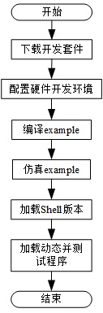

使用基于SDAccel的Example
=======================

[Switch to the English version](./Using_an_SDAccel_based_Example.md)

目录
-------------------------

[总体操作流程](#sec-1)

[下载开发套件](#sec-2)

[配置硬件开发环境](#sec-4)

[编译example](#sec-5)

[仿真example](#sec-6)

[加载Shell版本到FPGA卡](#sec-3)

[加载动态及测试](#sec-7)

<a id="sec-1" name="sec-1"></a>
总体操作流程
------------




<a id="sec-2" name="sec-2"></a>
下载开发套件
------------

在华为云上下载开发套件到本地服务器，下载路径如下：

```bash
https://github.com/Huawei/fpga-accel.git
```

在华为support网站上下载相关网表文件到用户服务器，下载路径如下：

```bash
https://huawei-fpga.obs.cn-north-1.myhwclouds.com
```

##### 说明:

下载的Shell版本信息可参考F40文件夹下的release_note.txt文件，用户根据需求进行下载。


所下载网表文件需存放在以下路径：

```bash
F40/sdaccel/hardware/sdaccel_design/lib/platform/xilinx_huawei-vu5p_2ddr-dynamic_5_1
```

<a id="sec-4" name="sec-4"></a>
配置硬件开发环境
------------

用户进入开发套件`F40`目录下，在进行SDAccel开发前，用户需要运行开发套件下的`setup.sh`脚本完成硬件开发环境的配置，命令如下：

```bash
cd F40/sdaccel/ 
export HW_FPGA_DIR=$(pwd)
source $HW_FPGA_DIR/setup.sh
```


<a id="sec-5" name="sec-5"></a>
编译example
------------

本开发套件中提供三个example供用户进行参考设计，具体如下：

`vadd_cl`：这是一个opencl 矢量相加的实例，基于opencl c实现kernel；

`mmult_hls`：这是一个基于opencl矩阵乘法实例，基于c实现kernel；

`vadd_rtl`：这是一个opencl 矢量相加的实例，基于rtl实现kernel。

此文档基于`mmult_hls`作为示例进行说明,另外两个example可参考此文档进行相关操作。

```bash
cd $HW_FPGA_DIR/hardware/sdaccel_design/examples/mmult_hls/scripts
sh compile.sh compile_mode
```

##### 说明:
   以下步骤的命令都可以通过–h参数获取帮助信息。  
   *compile_mode*为三种编译模式，对应可选择：  
   cpu_em ------------ cpu仿真模式，编译结束生成bin_mmult_cpu_emu.xclbin  
   hw_em ------------- 硬件仿真模式，编译结束生成bin_mmult_hw_emu.xclbin   
   hw ------------------ 硬件编译模式，编译结束生成bin_mmult_hw.xclbin   
   用户根据自身需求选择对应编译模式即可。 


<a id="sec-6" name="sec-6"></a>
仿真example
------------


##### 提示:

不需要仿真测试时，请跳过本章节。

进行mmult的cpu_em仿真编译：

```bash
cd $HW_FPGA_DIR/hardware/sdaccel_design/examples/mmult_hls/scripts
sh run.sh emu ../prj/bin/mmult ../prj/bin/bin_mmult_cpu_emu.xclbin
```

进行mmult的hw_em仿真编译：

```bash
cd $HW_FPGA_DIR/hardware/sdaccel_design/examples/mmult_hls/scripts
sh run.sh emu ../prj/bin/mmult ../prj/bin/bin_mmult_hw_emu.xclbin
```

##### 说明:

   *host*为编译生成的主机程序（硬件编译模式不支持仿真）：  
   mmult_hls示例 -------------------------- 对应主机程序为mmult  
   vadd_cl示例 ----------------------------- 对应主机程序为vadd  
   vadd_rtl示例 ----------------------------- 对应主机程序为host

   *xclbin*为编译生成的xclbin文件,不同的编译模式对应不同的xclbin文件：  
   *compile_mode*为cpu_em ----------- 对应选择bin_mmult_cpu_emu.xclbin  
   *compile_mode*为hw_em ------------ 对应选择bin_mmult_hw_emu.xclbin  

<a id="sec-3" name="sec-3"></a>
加载Shell版本到FPGA卡
------------

下载Shell版本到用户服务器，下载路径如下：

```bash
https://huawei-fpga.obs.cn-north-1.myhwclouds.com
```

使用开发套件中的脚本`fmtk`将下载的shell版本加载到FPGA卡中，该脚本路径如下：

```bash
F40/tools
```

##### 说明:

脚本`fmtk`使用方式可通过命令`./fmtk -h`进行查看；
加载完成后需要对服务器进行下上电处理，待服务器上电后再进行后续操作。

<a id="sec-7" name="sec-7"></a>
加载动态及测试
------------

执行run.sh完成硬件的动态部分加载及测试环节，具体步骤如下：

```bash
make
sh run.sh mmult $HW_FPGA_DIR/hardware/sdaccel_design/examples/mmult_hls/prj/bin/bin_mmult_hw.xclbin 0
```

##### 说明:

上面run.sh脚本末尾的0表示slot号，该号代表用户所使用环境的FPGA卡号。比如用户服务器带4张FPGA加速卡时，则slot号为0、1、2、3。
bin_mmult_hw.xclbin文件为mmult_hls example生成的xclbin文件。
run.sh具体使用请执行sh run.sh -h查看。