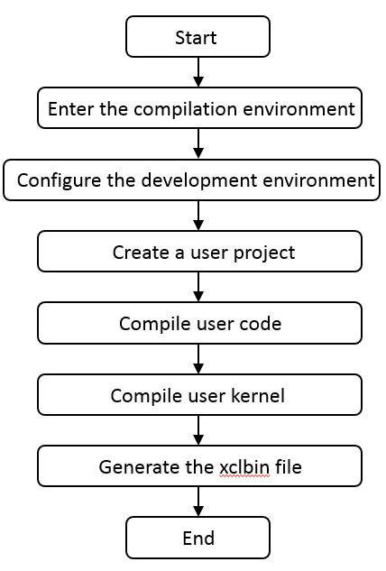

SDAccel-based Hardware Development Process
=======================

[切换到中文版](./Implementation_Process_of_SDAccel_based_Hardware_Development_cn.md)


Contents
-------------------------

[SDAccel-based Operation Process](#sec-1)

[Configuring the Development Environment](#sec-2)

[Create a User Project](#sec-3)

[SDAccel Development](#sec-4)

[SDAccel Simulation](#sec-5)

[Configuration a Project](#sec-6)

[Starting Version Compilation](#sec-7)

<a id="sec-1" name="sec-1"></a>

SDAccel-based Operation Process
-------------------------

The compilation and execution processes of the SDAccel platform are based on the SDx tool compilation environment and the execution environment that supports FPGA cards.

**Notes:**

The SDAccel platform provides two methods for creating a project.

-   Create a project and upload user-developed code to the compilation environment, or develop code on the platform.

-   Copy an example project, modify parameters, and add user code to meet user requirements. 


### User Operation Process

The following figure shows the user operation process.



#### The following table describes each step of the user operation process.

| Step                                   | Operation                                | Description                              |
| -------------------------------------- | ---------------------------------------- | ---------------------------------------- |
| Go to the compilation environment.     | Enter the compilation environment where the SDx has been installed. | Enter the compilation environment where the SDx has been installed. |
| Configure the development environment. | Configure the hardware development environment. | Run the setup.sh script to configure the hardware development environment. |
| Create a user project.                 | Create a user project.                   | Run a command to create a user project.  |
| Develop user code.                     | Develop user code.                       | Develop host and kernel code based on user requirements. SDAccel supports C/C++ for host code development and C/C++/OpenCL C/Verilog/VHDL for kernel code development. The source files must be stored in the **src** folder in the directory where the user project is located. |
| Compile the kernel.                    | Compile the kernel.                      | After configuring the project, run the compile.sh script to compile, link, and generate the host program, and to compile the kernel, implement synthesis, placing, and routing, and generate the target file. |
| Generate the target file.              | Generate the xclbin file.                | The generated file is stored in the user project directory /prj/bin/. |

<a id="sec-2" name="sec-2"></a>
Configuring the Development Environment
------------

After a user logs in to the user server, the SDAccel file is stored in the `FX300/sdaccel` directory by default. Configure the hardware development environment before SDAccel development.

#### Configuring the Development Environment

Run the `setup.sh` script to configure the hardware development environment.

```bash
cd FX300/sdaccel
export HW_FPGA_DIR=$(pwd)  
source $HW_FPGA_DIR/setup.sh
```

**Notes:**
Note: You can copy all the files of SDAccel to any directory on the user server. The following sections use the default directory as an example.

<a id="sec-3" name="sec-3"></a>
Create a User Project
------------

By default, user projects are stored in the `$HW_FPGA_DIR/hardware/sdacel_design/user` directory. Run the `create_prj.sh` script to create a project.

```bash
cd $HW_FPGA_DIR/hardware/sdaccel_design/user 
sh create_prj.sh <usr_prj_name> <kernel_mode>
```

**Notes:**
<usr_prj_name> is the user project name and is specified when users create a project. <kernel_mode> is the user project type, and users can select `temp_cl, temp_c, temp_rtl`. For details, see [Related Documents](../hardware/sdaccel_design/user/README_CN.md).

<a id="sec-4" name="sec-4"></a>
Implementing SDAccel-based Development
-----------
1. SDAccel supports OpenCL/C/Verilog/VHDL for kernel development. The source files must be stored in the `$HW_FPGA_DIR/hardware/sdaccel_design/user/<usr_prj_name>/src` directory of the `<usr_prj_name>` directory.
2. After the compilation is complete, users need to modify the Makefile in the `$HW_FPGA_DIR/hardware/sdaccel_design/user/<usr_prj_name>/src` directory of `<usr_prj_name>`, and modify variables `HOST_EXE = User host program name` and `KERNEL_NAME = Kernel name compiled by the user`.
3. After the Makefile is modified, go to the `$HW_FPGA_DIR/hardware/sdaccel_design/user/<usr_prj_name>/scripts/` directory and run `sh compile.sh hw` to complete the compilation and generate the executable files of the host program and the .xclbin file.

**Notes:**
The kernel name compiled by the user must be the same as the name of the kernel module.  
**Each compilation clears the previously compiled contents. If necessary, back up the compiled files before a new compilation.**

<a id="sec-5" name="sec-5"></a>
Implementing SDAccel-based Simulation
-----------

SDAccel supports the cpu-emulation and hw-emulation simulation modes.

#### Develop host and kernel code.

```bash
cd $HW_FPGA_DIR/hardware/sdaccel_design/user/<usr_prj_name>/src
```

The code must be stored in the src directory.

#### Configure compilation scripts.

```bash
cd $HW_FPGA_DIR/hardware/sdaccel_design/user/<usr_prj_name>/src
```

Configure host and kernel names in the Makefile file.

#### Implement simulation compilation.

```bash
cd $HW_FPGA_DIR/hardware/sdaccel_design/user/<usr_prj_name>/scripts 
sh compile.sh <emulation_mode>
```

#### Implement the simulation.

**Notes:**

The `example xclbin` and the compilation target `host` must be in the same directory, that is, `pri/bin`.

```bash
cd $HW_FPGA_DIR/hardware/sdaccel_design/user/<usr_prj_name>/scripts  
sh run.sh emu ../prj/bin/<example_host> ../prj/bin/<xclbin>
```

**Notes:**
For details about how to implement the simulation, see `HW_FPGA_DIR/hardware/sdaccel_design/user/<usr_prj_name>/README.md`.

<a id="sec-6" name="sec-6"></a>
Configuring a Project
--------

SDAccel supports one-click project building. Modify the Makefile file in the `$HW_FPGA_DIR/hardware/SDAccel_design/user/<usr_prj_name>/src/` directory to configure a project.

#### The configuration items include:

-   Host name

-   Kernel name

<a id="sec-7" name="sec-7"></a>
Implementing Project Compilation
------------

Run the `compile.sh` script to compile, link, and generate the host program, and to compile the kernel, implement synthesis, placing, and routing, and generate the target file.

```bash
cd $HW_FPGA_DIR/hardware/sdaccel_design/user/<usr_prj_name>/scripts/  
sh compile.sh hw
```

**Notes:**
For details, see `HW_FPGA_DIR/hardware/sdaccel_design/user/<usr_prj_name>/README.md`.  
**Each compilation clears the previously compiled contents. If necessary, back up the compiled files before a new compilation.**


