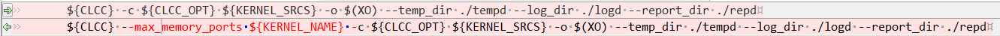

-----------
# Using Multiple DDR Banks
---

[切换到中文版](./Using Multiple DDR Banks_cn.md)

# 1. Xilinx User Guide and Examples

  - User guide:

    <https://www.xilinx.com/support/documentation/sw_manuals/xilinx2018_2/ug1207-sdaccel-optimization-guide.pdf>

    Using Multiple DDR Banks in Chapter 3

  - Examples:

    OpenCL cases: <https://github.com/Xilinx/SDAccel_Examples/tree/master/getting_started/kernel_to_gmem/gmem_2banks_ocl>  
    C language cases: <https://github.com/Xilinx/SDAccel_Examples/tree/master/getting_started/kernel_to_gmem/gmem_2banks_c>

# 2. Change History of vadd_cl example on the Platform

## 1. Kernel Code Modification


### 1.1 OpenCL Kernel Modification


  The following kernel attribute configuration is used to set a port for each parameter.

```bash 
__kernel __attribute__ ((reqd_work_group_size(1, 1, 1)))
void apply_watermark(__global const TYPE * __restrict input, __global
TYPE * __restrict output, int width, int height) {
...
}
```

Note: The preceding three modified AXI bus naming modes need to be used in the link options of XOCC.

## 2. Host Code Modification


`Note`: The user code `vadd.cpp` exists in the software directory. Therefore, the code of the `vadd_cl` case in the hardware directory and the `vadd.cpp` code of the `vadd_cl` case in the software directory must be the same.

cl_mem_ext_ptr_t` is a structure and its definition is as follows:

```bash
typedef struct{
unsigned flags;
void *obj;
void *param;
} cl_mem_ext_ptr_t;
```
* Valid values for `flags` are XCL_MEM_DDR_BANK0, XCL_MEM_DDR_BANK1,
  XCL_MEM_DDR_BANK2, and XCL_MEM_DDR_BANK3.
* `obj` is the pointer to the associated host memory allocated for the CL memory buffer only if
  CL_MEM_USE_HOST_PTR flag is passed to `clCreateBuffer` API, otherwise set it to NULL.
* `param` is reserved for future use. Always assign it to 0 or NULL.  
   See page 63 of the reference document `ug1207-sdaccel-optimization-guide.pdf`.

## 3. XOCC Link and Compilation Option Modification in Makefile


Link option (The upper line is the option before the modification and the lower line is the option after the modification)



Compilation option (The upper line is the option before the modification and the lower line is the option after the modification)


