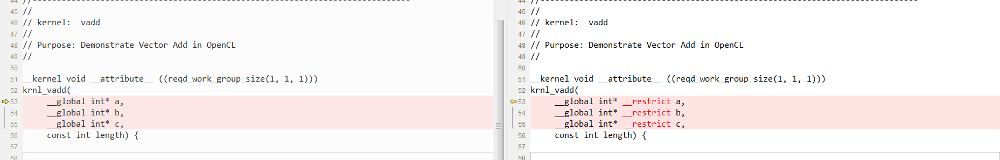
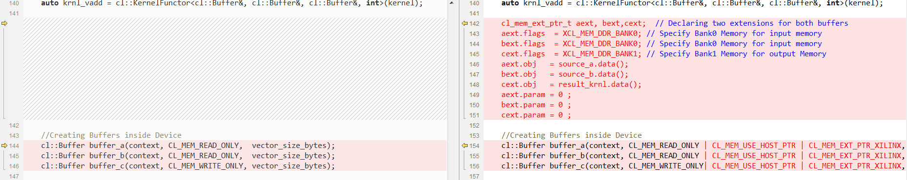
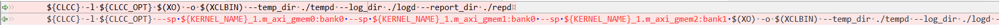

-----------
# Using Multiple DDR Banks
---

[Switch to the English version](./Using Multiple DDR Banks.md)

# 1. xilinx 用户手册及参考实例

  - 用户手册参考:

    <https://www.xilinx.com/support/documentation/sw_manuals/xilinx2018_2/ug1207-sdaccel-optimization-guide.pdf>

    第三章 Using Multiple DDR Banks.

  - 实例参考:

    opencl 用例参考 <https://github.com/Xilinx/SDAccel_Examples/tree/master/getting_started/kernel_to_gmem/gmem_2banks_ocl>  
    c 语言用例参考：<https://github.com/Xilinx/SDAccel_Examples/tree/master/getting_started/kernel_to_gmem/gmem_2banks_c>

# 2.本平台vadd_cl example修改记录

## 1. kernel代码修改


### 1.1 opencl kernel 修改方式



  此处要用到下面的kernel属性配置，给每个参数设置端口。

```bash 
__kernel __attribute__ ((reqd_work_group_size(1, 1, 1)))
void apply_watermark(__global const TYPE * __restrict input, __global
TYPE * __restrict output, int width, int height) {
...
}
```

注意：以上三种修改的AXI总线的命称方式，需要在xocc 的链接选项中用到。

## 2. host代码修改


`注意`：因为我们的software目录下也存在用户代码`vadd.cpp`，所以hardware下的`vadd_cl`用例跟 software下的`vadd_cl`用例的`vadd.cpp`代码都需要修改并且保持一致。

cl_mem_ext_ptr_t` 是个结构体，其定义如下：

```bash
typedef struct{
unsigned flags;
void *obj;
void *param;
} cl_mem_ext_ptr_t;
```
* Valid values for `flags` are XCL_MEM_DDR_BANK0, XCL_MEM_DDR_BANK1,
  XCL_MEM_DDR_BANK2, and XCL_MEM_DDR_BANK3.
* `obj` is the pointer to the associated host memory allocated for the CL memory buffer only if
  CL_MEM_USE_HOST_PTR flag is passed to `clCreateBuffer` API, otherwise set it to NULL.
* `param` is reserved for future use. Always assign it to 0 or NULL.  
   见参考文档`ug1207-sdaccel-optimization-guide.pdf`第63页。

## 3. Makefile中xocc链接和编译选项修改



链接增加选项（上面为修改前，下面的是修改后）。


编译选项增加选项（上面为修改前，下面的是修改后）。

