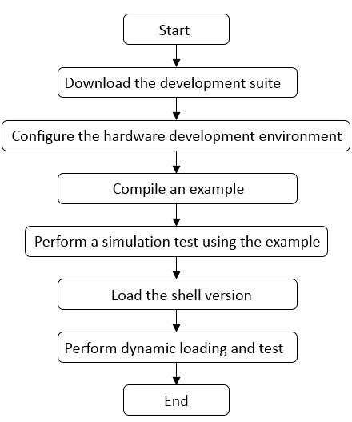

Using an SDAccel-based Example
=======================

[切换到中文版](./Using_an_SDAccel_based_Example_cn.md)

Contents
-------------------------

[Overall Operation Process](#sec-1)

[Downloading the Development Suite](#sec-2)

[Configuring the Hardware Development Environment](#sec-4)

[Compiling Examples](#sec-5)

[Performing Simulation Tests Using Examples](#sec-6)

[Loading the Shell Version to the FPGA Card](#sec-3)

[Perform Dynamic Loading and Test](#sec-7)

<a id="sec-1" name="sec-1"></a>
Overall Operation Procedure
------------




<a id="sec-2" name="sec-2"></a>
Downloading the Development Suite
------------

Download the development suite to the user server. The download path is as follows:

For HTTPS connections, run the `git clone https://github.com/Huawei/fpga-accel.git` command to download the development suite.

For SSH connections, run the `git clone git@github.com/Huawei/fpga-accel.git` command to download the development suite.

Before starting the hardware development process, download the related network table files to the user server. The download path is as follows: (The following information assumes that the user server OS is Linux ant the initial version is `01210125`. If you need to download another version, replace `01210125` in the following commands with the actual version.

```bash
curl -k -s -O --retry 3 https://huawei-fpga.obs.cn-north-1.myhwclouds.com/FX300/hardware/sdaccel_design/dsa_v01210125/xilinx_huawei-vu5p_2ddr-dynamic_5_1.dsa

curl -k -s -O --retry 3 https://huawei-fpga.obs.cn-north-1.myhwclouds.com/FX300/hardware/sdaccel_design/dsa_v01210125/xilinx_huawei-vu5p_2ddr-dynamic_5_1.spfm

curl -k -s -O --retry 3 https://huawei-fpga.obs.cn-north-1.myhwclouds.com/FX300/hardware/sdaccel_design/dsa_v01210125/xilinx_huawei-vu5p_2ddr-dynamic_5_1.xpfm
```

#### Note:

For details about the downloaded network table files and versions, see the `release_note.md` file. You can download the files as required.

The downloaded network table file package includes three files `xilinx_huawei-vu5p_2ddr-dynamic_5_1.dsa, xilinx_huawei-vu5p_2ddr-dynamic_5_1.spfm, and xilinx_huawei-vu5p_2ddr-dynamic_5_1.xpfm`. The downloaded files are stored in the following directories:

```bash
FX300/sdaccel/hardware/sdaccel_design/lib/platform/xilinx_huawei-vu5p_2ddr-dynamic_5_1
```

<a id="sec-4" name="sec-4"></a>
Configure the hardware development environment.
------------

Before you go to the `FX300` directory of the development suite and start SDAccel-based development, you need to run the `setup.sh` script in the development suite to configure the hardware development environment. The commands are as follows:

```bash
cd FX300/sdaccel/ 
export HW_FPGA_DIR=$(pwd)
source $HW_FPGA_DIR/setup.sh
```


<a id="sec-5" name="sec-5"></a>
Compiling Examples
------------

The development suite provides three examples for design reference. The details are as follows:

`vadd_cl`: This is an example of OpenCL vector addition, using OpenCL C for kernel code development.

`mmult_hls`: This is an example of OpenCL matrix multiplication, using C for kernel code development.

`vadd_rtl`: This is an example of OpenCL vector addition, using RTL for kernel code development.

This document uses `mmult_hls` as an example. You can refer to this document to perform related operations for the other two examples.

```bash
cd $HW_FPGA_DIR/hardware/sdaccel_design/examples/mmult_hls/scripts
sh compile.sh compile_mode
```

##### Note:
   You can use the – h parameter to obtain help information in the following steps.  
   *compile_mode* contains three compilation modes:  
   cpu_em ------------ cpu simulation mode; bin_mmult_cpu_emu.xclbin is generated after the compilation is complete.  
   hw_em ------------- hardware simulation mode; bin_mmult_hw_emu.xclbin is generated after the compilation is complete.   
   hw ------------------ hardware compilation mode; bin_mmult_hw.xclbin is generated after the compilation is complete.   
   Users can select a compilation mode as required. 


<a id="sec-6" name="sec-6"></a>
Performing Simulation Tests Using Examples
------------


##### Note:

Skip this section if the simulation test is not required.

Perform the mmult cpu_em simulation compilation.

```bash
cd $HW_FPGA_DIR/hardware/sdaccel_design/examples/mmult_hls/scripts
sh run.sh emu ../prj/bin/mmult ../prj/bin/bin_mmult_cpu_emu.xclbin
```

Perform hw_em simulation compilation for mmult.

```bash
cd $HW_FPGA_DIR/hardware/sdaccel_design/examples/mmult_hls/scripts
sh run.sh emu ../prj/bin/mmult ../prj/bin/bin_mmult_hw_emu.xclbin
```

##### Note:

   *host* is the host program generated during compilation (the hardware compilation mode does not support simulation):  
   mmult_hls example -------------------------- The host program is mmult.  
   vadd_cl example -------------------------- The host program is vadd.  
   vadd_rtl example -------------------------- The host program is host.

   *.xclbin* is the .xclbin file generated during compilation. Different compilation modes correspond to different .xclbin files.  
   If the *compile_mode* is cpu_em ----------- select bin_mmult_cpu_emu.xclbin.  
   If the *compile_mode* is hw_em ----------- select bin_mmult_hw_emu.xclbin.  

<a id="sec-3" name="sec-3"></a>
Loading the Shell Version to the FPGA Card
------------

Download the bin file of the Shell version to the user server. The download path is as follows: (The following information assumes that the user server OS is Linux ant the initial version is `01210125`. If you need to download another version, replace `01210125` in the following command with the actual version.)

```bash
curl -k -s -O --retry 3 https://huawei-fpga.obs.cn-north-1.myhwclouds.com/FX300/hardware/sdaccel_design/bin_v01210125/hcf_sdaccel_x_vu5p_1xpr_shell.bin
```

Use the `fmtk` tool to load the downloaded shell bin to the FPGA card. Log in to the `http://support.huawei.com/enterprise/en/index.html` and enter the keyword `fmtk` in the search box to obtain the software package.

#### Note:

After the tool is loaded, power on the server and perform subsequent operations after the server is powered on.

<a id="sec-7" name="sec-7"></a>
Perform Dynamic Loading and Test
------------

Run the run.sh script to perform dynamic loading and test of the hardware. The command is as follows:

```bash
make
sh run.sh mmult $HW_FPGA_DIR/hardware/sdaccel_design/examples/mmult_hls/prj/bin/bin_mmult_hw.xclbin 0
```

##### Note:

0 at the end of the run.sh script indicates the slot number, which indicates the FPGA card number of the user environment. For example, if the user server has four FPGA accelerator cards, the slot numbers are 0, 1, 2, and 3.
The bin_mmult_hw.xclbin file is the xclbin file generated by the mmult_hls example.
Run sh run.sh -h to query how to use run.sh.


