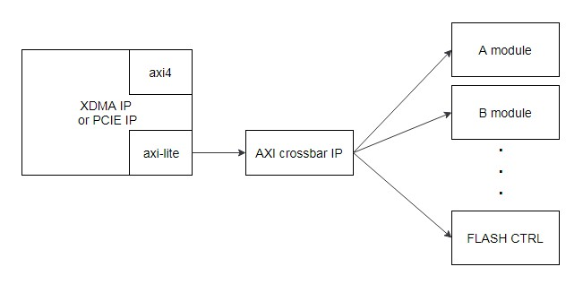

FLASH Component Integration Development Guide
=======

[切换到中文版](./README_CN.md)

This chapter describes how to integrate Huawei's FLASH component into a user project.

Contents
-------
[Overview](#a)

[Component Specifications](#b)

[Component Integration Method](#c)

<a name="a"></a>

Overview
-------
###Release 1.1
- This is the initial version of the component. The version information is 0x19E50111.

###Component Function
Huawei provides the FLASH component (DCP type). After the logic of the component is instantiated, you can use software to burn the flash of the FX600 accelerator card to upgrade the logic. This component uses AXI-Lite interfaces and supports SPI SCK frequency configuration, read data CRC64 verification, and flash burning (supports products from multiple vendors).

###Component Download Address
You can download the component DCP file from the following website:
https://huawei-fpga.obs.cn-north-1.myhwclouds.com/FX600/hardware/hw_platform/component/FLASH/v1.1/flash_ctrl.dcp

On Linux, run the following command to download the file:

```bash
curl -k -s -O --retry 3 https://huawei-fpga.obs.cn-north-1.myhwclouds.com/FX600/hardware/hw_platform/component/FLASH/v1.1/flash_ctrl.dcp
```

<a name="b"></b>

Component Specifications
--------

###Usage Scope
This component is used for Huawei's FX600 FPGA accelerator card. The component DCP file uses Vivado 2017.2 for compilation. Users' version cannot be earlier than this version.

###Speed
In SPI x1 mode, burning a 50 MB bin file into the flash takes 3 minutes.

###Resource Utilization
The following table describes the resource utilization of the FLASH component after DCP integration.

| Resource | Utilization |
| -------- | ----------- |
| LUT      | 878         |
| FF       | 1131        |
| IO       | 105         |
| BUFG     | 1           |


###Component Version Information
Access the component version information register to obtain the component version information. The access address format is *base address + offset address*. (The offset address is 0xC00, and the base address is allocated by users. For details about the allocation principles, see the *"Component Base Address Allocation"* section.) For example, when the initial version component is used, if the value in the component version information register is 0x19E50111, the component integration is successful.

###Component Interfaces
**Note:** The reset signal is effective when at high level.

| Signal Name         | Interface Type | Width  | I/O  | Initial Status | Description                              |
| ------------------- | -------------- | ------ | ---- | -------------- | ---------------------------------------- |
| FLASH signal        |                |        |      |                |                                          |
| program_inband_ctrl | N/A            | [0:0]  | O    | 1              | FPGA reload configuration signal         |
| s_axil_spi_areset   | N/A            | [0:0]  | I    | -              | Component reset signal (effective when at high level) |
| s_axil_spi_aclk     | N/A            | [0:0]  | I    | -              | SPI clock signal in the component        |
| AXI-Lite bus signal |                |        |      |                |                                          |
| s_axil_spi_awvalid  | AXI-Lite       | [0:0]  | I    | -              | Write address channel valid signal       |
| s_axil_spi_awaddr   | AXI-Lite       | [31:0] | I    | -              | Write address channel addr signal        |
| s_axil_spi_awready  | AXI-Lite       | [0:0]  | O    | -              | Write address channel valid signal       |
| s_axil_spi_wvalid   | AXI-Lite       | [0:0]  | I    | -              | Write data channel valid signal          |
| s_axil_spi_wdata    | AXI-Lite       | [31:0] | I    | -              | Write data channel data signal           |
| s_axil_spi_wstrb    | AXI-Lite       | [3:0]  | I    | -              | Write data channel wstrb signal          |
| s_axil_spi_wready   | AXI-Lite       | [0:0]  | O    | -              | Write data channel ready signal          |
| s_axil_spi_bvalid   | AXI-Lite       | [0:0]  | O    | -              | Response channel valid signal            |
| s_axil_spi_bresp    | AXI-Lite       | [1:0]  | O    | -              | Response channel resp signal             |
| s_axil_spi_bready   | AXI-Lite       | [0:0]  | I    | -              | Response channel ready signal            |
| s_axil_spi_arvalid  | AXI-Lite       | [0:0]  | I    | -              | Read address channel valid signal        |
| s_axil_spi_araddr   | AXI-Lite       | [31:0] | I    | -              | Read address channel addr signal         |
| s_axil_spi_arready  | AXI-Lite       | [0:0]  | O    | -              | Read address channel ready signal        |
| s_axil_spi_rvalid   | AXI-Lite       | [0:0]  | O    | -              | Read data channel valid signal           |
| s_axil_spi_rdata    | AXI-Lite       | [31:0] | O    | -              | Read data channel data signal            |
| s_axil_spi_rresp    | AXI-Lite       | [1:0]  | O    | -              | Read data channel resp signal            |
| s_axil_spi_rready   | AXI-Lite       | [0:0]  | I    | -              | Read data channel ready signal           |

<a name="c"></c>

Component Integration Method
--------

###Reference Solution for Component Connection
This component uses AXI-Lite interfaces. Therefore, the component must be mounted to the PCIe AXI-Lite bus. The following figure shows the reference connection method. The PCIe or XDMA module has only one AXI-Lite interface. You need to extend one AXI-Lite Master interface into multiple AXI-Lite Master interfaces by using an IP core or module (such as AXI Crossbar), and connect the interfaces to the component.



###Component Instantiation Method
Open a Vivado project, click add source to add the DCP file to the project, and instantiate the component at required positions in the code by referring to the following verilog code. Ensure that the interfaces of the instantiated component are the same as the signal interfaces in the DCP file.
For example:

```verilog
flash_ctrl u_flash_ctrl (     
    .program_inband_ctrl  (program_inband_ctrl ), //output wire           program_inband_ctrl
    .s_axil_spi_aclk      (axil_aclk           ), //input  wire           s_axil_spi_aclk    
    .s_axil_spi_areset    (axil_areset         ), //input  wire           s_axil_spi_aresetn 
    .s_axil_spi_awaddr    (axil_awaddr         ), //input  wire [31 : 0]  s_axil_spi_awaddr  
    .s_axil_spi_awprot    (axil_awprot         ), //input  wire [2 : 0]   s_axil_spi_awprot  
    .s_axil_spi_awvalid   (axil_awvalid        ), //input  wire           s_axil_spi_awvalid 
    .s_axil_spi_awready   (axil_awready        ), //output wire           s_axil_spi_awready 
    .s_axil_spi_wdata     (axil_wdata          ), //input  wire [31 : 0]  s_axil_spi_wdata   
    .s_axil_spi_wstrb     (axil_wstrb          ), //input  wire [3 : 0]   s_axil_spi_wstrb   
    .s_axil_spi_wvalid    (axil_wvalid         ), //input  wire           s_axil_spi_wvalid  
    .s_axil_spi_wready    (axil_wready         ), //output wire           s_axil_spi_wready  
    .s_axil_spi_bvalid    (axil_bvalid         ), //output wire           s_axil_spi_bvalid  
    .s_axil_spi_bresp     (axil_bresp          ), //output wire [1 : 0]   s_axil_spi_bresp   
    .s_axil_spi_bready    (axil_bready         ), //input  wire           s_axil_spi_bready  
    .s_axil_spi_araddr    (axil_araddr         ), //input  wire [31 : 0]  s_axil_spi_araddr  
    .s_axil_spi_arprot    (axil_arprot         ), //input  wire [2 : 0]   s_axil_spi_arprot  
    .s_axil_spi_arvalid   (axil_arvalid        ), //input  wire           s_axil_spi_arvalid 
    .s_axil_spi_arready   (axil_arready        ), //output wire           s_axil_spi_arready 
    .s_axil_spi_rdata     (axil_rdata          ), //output wire [31 : 0]  s_axil_spi_rdata   
    .s_axil_spi_rresp     (axil_rresp          ), //output wire [1 : 0]   s_axil_spi_rresp   
    .s_axil_spi_rvalid    (axil_rvalid         ), //output wire           s_axil_spi_rvalid  
    .s_axil_spi_rready    (axil_rready         )  //input  wire           s_axil_spi_rready 
    );
```

###Project Settings

####Input Clock
If the frequency of the component clock (s_axil_spi_aclk) is too high, the timing of the SPI interfaces does not meet the requirement. If the frequency is too low, SPI interface flash burning will be slow. For the current component, you can select one of the following clock frequencies: 50 MHz, 100 MHz, or 200MHz.

####Base Address Allocation
You need to allocate a base address to the component by using AXI routing modules such as AXI Crossbar or AXI SmartConnect. These modules match the upper bits of AXI addresses with the base address set by users to determine the target modules of the AXI signals. The FLASH component uses the lower 14 bits of the address. Therefore, the base address allocated by users cannot occupy the lower 14 bits. For example, 0x8000 is a correct base address, and 0x6000 is an incorrect base address (bit 13 is occupied).

**Note:** This component uses the address space of the 4 Kbytes. The sum of the base address allocated by the user and the address space used by the component cannot be greater than the upper limit of the address space of the PCIe BAR. For example, if the BAR space is 64 KB, the base address cannot be greater than 0xF000.

####Device ID Settings
To avoid ID conflict between user logic PCIe devices and other Huawei devices and facilitate user logic identification by software and hardware tools of the component, you are advised to use the following device ID settings.


####Constraints
Modify the XDC file of the project.
1. To connect the program_inband_ctrl signal to the top layer of the project and restrict the signal to the output pin of the FPGA. The constraint information is as follows:

```tcl
set_property PACKAGE_PIN AP23    [get_ports program_inband_ctrl]
set_property IOSTANDARD  LVCMOS18 [get_ports program_inband_ctrl]
```

The first command restricts the pin position, and the second command restricts the pin level. Add the two constraints to the XDC file.

**Note:** Change program_inband_ctrl after get_ports to the name of the final output signal of the top layer.

2. Set attributes such as the mode and rate used when the FPGA reads data from the flash memory.

```tcl
set_property BITSTREAM.GENERAL.COMPRESS TRUE [current_design]
set_property BITSTREAM.CONFIG.CONFIGRATE 21.3 [current_design]
set_property CONFIG_VOLTAGE 1.8 [current_design]
set_property BITSTREAM.CONFIG.SPI_32BIT_ADDR YES [current_design]
set_property BITSTREAM.CONFIG.SPI_BUSWIDTH 4 [current_design]
```

3. Add timing constraints on several paths. The FPGA card is connected to the flash memory through the STARUP interface. If FLASH is far away from the STARUP interface, the timing may not meet the requirement when the SPI accesses the flash memory (Vivado does not calculate the timing of this path). The constraints are as follows:

```tcl
set_max_delay -datapath_only -from [get_cells -hier *spi_sck_reg] -to [get_pins -hier *STARTUP*_inst/USRCCLKO] 2.000
set_max_delay -datapath_only -from [get_cells -hier *spi_mosi_reg] -to [get_pins -hier {*STARTUP*_inst/DO[0]}] 2.000
set_max_delay -datapath_only -from [get_pins -hier {*STARTUP*_inst/DI[1]}] -to [get_cells -hier {*rx_data_buf_sft_reg[0]}] 2.000
```

For details about other constraints in the XDC file, see the *"Pin Constraint File Reference"* section in the FX600 Developer Guide.
Download the FX600 Developer Guide from the Huawei support website:
<https://support.huawei.com/enterprise/zh/doc/EDOC1100053259>

###Tools
Use the FMTK tool provided by Huawei. For details about how to use the tool, see section 3.2 "Software Tool Installation and Upgrade" and chapter 6 "FPGA Firmware Burning" in the *FX600 User Guide*.
Download the FX600 User Guide from the Huawei support website:
<https://support.huawei.com/enterprise/zh/doc/EDOC1100053260>


