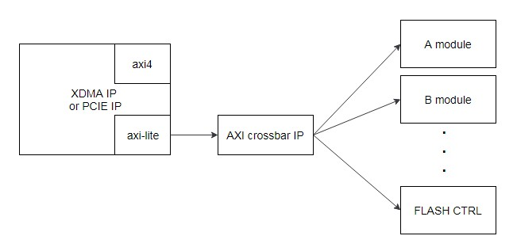
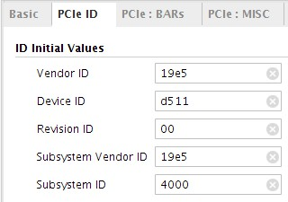

FLASH 组件的集成开发指导
=======

[Switch to the English version](./README.md)

本章节主要介绍如何集成华为的FLASH 组件到用户工程之中。

目录
-------
[简介](#a)

[产品规格](#b)

[组件集成方法](#c)

<a name="a"></a>

简介
-------
###Release 1.1
- 组件初始版本，版本信息：0x19E50111。

###组件功能
华为向用户提供了FLASH 组件（DCP类型），例化该组件的逻辑就可以通过配套软件烧写华为FX600加速卡的Flash，从而实现逻辑升级的功能。该组件采用了AXI-LITE协议接口，支持SPI SCK频率可配、读出数据CRC64校验，以及支持多厂家Flash器件烧写功能。

###组件下载地址
用户可以从下面的网址下载该组件dcp：
https://huawei-fpga.obs.cn-north-1.myhwclouds.com/FX600/hardware/hw_platform/component/FLASH/v1.1/flash_ctrl.dcp

如果是在linux系统上， 可以使用以下命令下载：

```bash
curl -k -s -O --retry 3 https://huawei-fpga.obs.cn-north-1.myhwclouds.com/FX600/hardware/hw_platform/component/FLASH/v1.1/flash_ctrl.dcp
```

<a name="b"></b>

产品规格
--------

### 使用范围
华为FX600 FPGA加速卡。组件DCP 采用vivado 2017.2编译，用户工程不能低于该版本。

###速度
烧写Flash时采用SPI x1模式，50M大小bin文件可以在3分钟内烧写完成。

### 资源占用情况
FLASH 组件DCP综合后的资源占用情况如下表所示。

| Resource | Utilization |
| -------- | ----------- |
| LUT      | 878         |
| FF       | 1131        |
| IO       | 105         |
| BUFG     | 1           |


### 组件版本信息
访问组件版本信息寄存器，可以获得组件版本信息。访问地址格式为 *基地址+偏移地址*（偏移地址0xC00；基地址用户自行分配，分配原则参考下面*“组件基地址分配”*章节描述）。以初始版本组件为例，如果访问组件版本信息寄存器，得到的结果为0x19E50111，则可以初步判断组件集成成功。

###组件接口描述
**注意：**复位信号是高电平有效。

| 信号名称            | 接口类型 | 位宽   | I/O  | 初始状态 | 描述                     |
| ------------------- | -------- | ------ | ---- | -------- | ------------------------ |
| FLASH信号           |          |        |      |          |                          |
| program_inband_ctrl | NA       | [0:0]  | O    | 1        | FPGA重加载配置信号       |
| s_axil_spi_areset   | NA       | [0:0]  | I    | -        | 组件复位信号，高电平有效 |
| s_axil_spi_aclk     | NA       | [0:0]  | I    | -        | 组件内spi时钟信号        |
| AXI-LITE   总线信号 |          |        |      |          |                          |
| s_axil_spi_awvalid  | AXI-LITE | [0:0]  | I    | -        | 写地址通道valid信号      |
| s_axil_spi_awaddr   | AXI-LITE | [31:0] | I    | -        | 写地址通道addr信号       |
| s_axil_spi_awready  | AXI-LITE | [0:0]  | O    | -        | 写地址通道ready信号      |
| s_axil_spi_wvalid   | AXI-LITE | [0:0]  | I    | -        | 写数据通道valid信号      |
| s_axil_spi_wdata    | AXI-LITE | [31:0] | I    | -        | 写数据通道data信号       |
| s_axil_spi_wstrb    | AXI-LITE | [3:0]  | I    | -        | 写数据通道wstrb信号      |
| s_axil_spi_wready   | AXI-LITE | [0:0]  | O    | -        | 写数据通道ready信号      |
| s_axil_spi_bvalid   | AXI-LITE | [0:0]  | O    | -        | 响应通道valid信号        |
| s_axil_spi_bresp    | AXI-LITE | [1:0]  | O    | -        | 响应通道resp信号         |
| s_axil_spi_bready   | AXI-LITE | [0:0]  | I    | -        | 响应通道ready信号        |
| s_axil_spi_arvalid  | AXI-LITE | [0:0]  | I    | -        | 读地址通道valid信号      |
| s_axil_spi_araddr   | AXI-LITE | [31:0] | I    | -        | 读地址通道addr信号       |
| s_axil_spi_arready  | AXI-LITE | [0:0]  | O    | -        | 读地址信号ready信号      |
| s_axil_spi_rvalid   | AXI-LITE | [0:0]  | O    | -        | 读数据通道valid信号      |
| s_axil_spi_rdata    | AXI-LITE | [31:0] | O    | -        | 读数据通道data信号       |
| s_axil_spi_rresp    | AXI-LITE | [1:0]  | O    | -        | 读数据通道resp信号       |
| s_axil_spi_rready   | AXI-LITE | [0:0]  | I    | -        | 读数据信号ready信号      |

<a name="c"></c>

组件集成方法
--------

###组件连接参考方案
由于组件采用了axi-lite接口，所以需要挂载在pcie的axi-lite总线上。参考连接方式如下图所示，pcie模块或者是xdma模块只有一路axi-lite接口，所以后级需要使用axi crossbar这类IP或模块，将一路axi-lite master接口，扩展为多个axi-lite master接口，然后再和组件连接。



###组件例化方法
打开vivado工程，点击add source添加dcp到工程内，然后参考下面的verilog 代码，在代码中需要的位置例化该组件即可。注意例化组件的接口要和dcp里的接口信号完全一致。
例如：

```verilog
flash_ctrl u_flash_ctrl (     
    .program_inband_ctrl  (program_inband_ctrl ), //output wire           program_inband_ctrl
    .s_axil_spi_aclk      (axil_aclk           ), //input  wire           s_axil_spi_aclk    
    .s_axil_spi_areset    (axil_areset         ), //input  wire           s_axil_spi_aresetn 
    .s_axil_spi_awaddr    (axil_awaddr         ), //input  wire [31 : 0]  s_axil_spi_awaddr  
    .s_axil_spi_awprot    (axil_awprot         ), //input  wire [2 : 0]   s_axil_spi_awprot  
    .s_axil_spi_awvalid   (axil_awvalid        ), //input  wire           s_axil_spi_awvalid 
    .s_axil_spi_awready   (axil_awready        ), //output wire           s_axil_spi_awready 
    .s_axil_spi_wdata     (axil_wdata          ), //input  wire [31 : 0]  s_axil_spi_wdata   
    .s_axil_spi_wstrb     (axil_wstrb          ), //input  wire [3 : 0]   s_axil_spi_wstrb   
    .s_axil_spi_wvalid    (axil_wvalid         ), //input  wire           s_axil_spi_wvalid  
    .s_axil_spi_wready    (axil_wready         ), //output wire           s_axil_spi_wready  
    .s_axil_spi_bvalid    (axil_bvalid         ), //output wire           s_axil_spi_bvalid  
    .s_axil_spi_bresp     (axil_bresp          ), //output wire [1 : 0]   s_axil_spi_bresp   
    .s_axil_spi_bready    (axil_bready         ), //input  wire           s_axil_spi_bready  
    .s_axil_spi_araddr    (axil_araddr         ), //input  wire [31 : 0]  s_axil_spi_araddr  
    .s_axil_spi_arprot    (axil_arprot         ), //input  wire [2 : 0]   s_axil_spi_arprot  
    .s_axil_spi_arvalid   (axil_arvalid        ), //input  wire           s_axil_spi_arvalid 
    .s_axil_spi_arready   (axil_arready        ), //output wire           s_axil_spi_arready 
    .s_axil_spi_rdata     (axil_rdata          ), //output wire [31 : 0]  s_axil_spi_rdata   
    .s_axil_spi_rresp     (axil_rresp          ), //output wire [1 : 0]   s_axil_spi_rresp   
    .s_axil_spi_rvalid    (axil_rvalid         ), //output wire           s_axil_spi_rvalid  
    .s_axil_spi_rready    (axil_rready         )  //input  wire           s_axil_spi_rready 
    );
```

###工程设置

####输入时钟
组件时钟（s_axil_spi_aclk）频率过高的话会导致SPI接口时序不满足要求，频率过低的话会导致SPI接口烧写Flash速度过慢。对于当前组件，用户可以选用50MHz、100MHz或200MHz这三种时钟频率中的一种。

####组件基地址分配
用户需要给组件分配基地址，一般是通过axi crossbar或者axi smartconnect这类axi路由模块完成的，这类模块会将axi地址的高位与用户设置的基地址进行匹配判断，然后根据结果将axi信号路由给后级的各个模块。由于FLASH 组件内部使用了地址的低14bit，所以用户分配的基地址不能占用低14bit，例如0x8000是正确基地址，0x6000是错误的基地址（占用了bit13）。

**注意：**该组件占用了4Kbytes的地址空间，用户分配的基地址加上组件占用地址空间之和不能大于PCIE BAR空间的地址上限。例如，假设BAR空间只有64K大小，那么基地址就不能大于0xF000。

####Device ID设置
为了避免用户逻辑的PCIE Device ID与华为其他设备冲突，同时也为了方便组件配套软硬件工具识别用户逻辑，推荐用户使用的Devcie ID设置如下图所示：



####工程约束
工程的xdc约束文件，也需要修改。
1. 要将该program_inband_ctrl信号连接至工程的顶层，并约束为FPGA的输出管脚，约束信息参考如下：

```tcl
set_property PACKAGE_PIN AP23    [get_ports program_inband_ctrl]
set_property IOSTANDARD  LVCMOS18 [get_ports program_inband_ctrl]
```

第一句约束管脚位置，第二句约束管脚电平，将这两句约束加入xdc文件即可。

**注意：**get_ports 后面的“program_inband_ctrl” 要使用顶层最终输出的信号名。

2. 需要设置FPGA芯片从Flash中读取数据时的模式、速度率等属性。

```tcl
set_property BITSTREAM.GENERAL.COMPRESS TRUE [current_design]
set_property BITSTREAM.CONFIG.CONFIGRATE 21.3 [current_design]
set_property CONFIG_VOLTAGE 1.8 [current_design]
set_property BITSTREAM.CONFIG.SPI_32BIT_ADDR YES [current_design]
set_property BITSTREAM.CONFIG.SPI_BUSWIDTH 4 [current_design]
```

3. 需要增加几个路径的时序约束。因为FPGA卡通过STARUP接口与Flash连接，如果FLASH 组件在布局布线时距离STARUP接口过远，有可能导致SPI访问Flash路径时序不满足要求（Vivado不会计算评估这段路径的时序）。参考约束如下：

```tcl
set_max_delay -datapath_only -from [get_cells -hier *spi_sck_reg] -to [get_pins -hier *STARTUP*_inst/USRCCLKO] 2.000
set_max_delay -datapath_only -from [get_cells -hier *spi_mosi_reg] -to [get_pins -hier {*STARTUP*_inst/DO[0]}] 2.000
set_max_delay -datapath_only -from [get_pins -hier {*STARTUP*_inst/DI[1]}] -to [get_cells -hier {*rx_data_buf_sft_reg[0]}] 2.000
```

xdc中的其他约束设置，参考《FX600 开发者指南》中的*“管脚约束文件参考”*章节即可。
《FX600 开发者指南》可以在华为support网站下载，地址：
<https://support.huawei.com/enterprise/zh/doc/EDOC1100053259>

###配套软件工具
需要配套使用华为提供的FMTK软件工具，操作流程参考《FX600 用户指南》中*“3.2 安装和升级FMTK工具”*以及*“6 FPGA固件烧写”*章节。
《FX600 用户指南》可以在华为support网站下载，地址：
<https://support.huawei.com/enterprise/zh/doc/EDOC1100053260>

