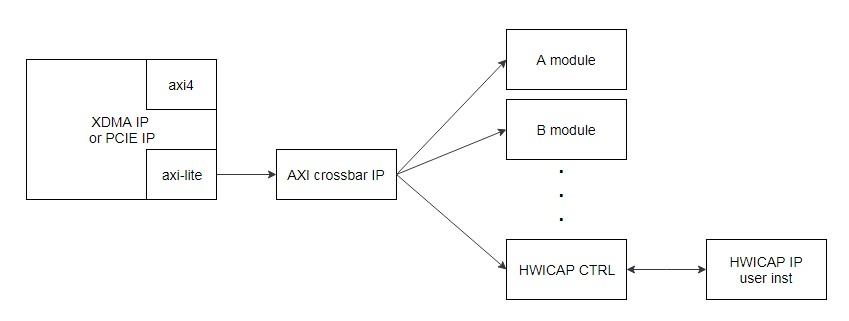
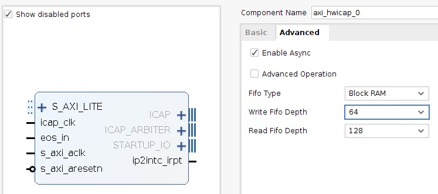
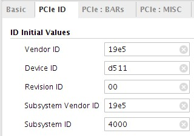

ICAP Component Integration Development Guide
=======

[切换到中文版](./README_CN.md)

This chapter describes how to integrate Huawei's ICAP component into a user project.

Contents
-------
[Overview](#a)

[Component Specifications](#b)

[Component Integration Method](#c)

[Appendix](#d)

<a name="a"></a>

Overview
-------
###Release 1.1
- This is the initial version of the component. The version information is 0x19E50011.

###Component Function
Huawei provides the ICAP component (DCP type). After the logic of this component is instantiated, you can use the warm boot function to update the logic in the flash without shutting down the OS. This component uses AXI-Lite interfaces.

###Component Download Address
You can download the component DCP file from the following website:
<https://huawei-fpga.obs.cn-north-1.myhwclouds.com/FX600/hardware/hw_platform/component/ICAP/v1.1/hwicap_top.dcp>

On Linux, run the following command to download the file:

```bash
curl -k -s -O --retry 3 https://huawei-fpga.obs.cn-north-1.myhwclouds.com/FX600/hardware/hw_platform/component/ICAP/v1.1/hwicap_top.dcp
```

<a name="b"></b>

Component Specifications
--------

###Usage Scope
This component is used for Huawei's FX600 FPGA accelerator card. The component DCP file uses Vivado 2017.2 for compilation. Users' version cannot be earlier than this version.

###Speed
When you use a tool to perform reloading, it takes 3 minutes to 5 minutes for the logic to take effect.

###Resource Utilization
The following table describes the resource utilization of the ICAP component after DCP integration.

| Resource | Utilization |
| -------- | ----------- |
| LUT      | 764         |
| FF       | 1313        |
| BRAM     | 1.50        |
| BUFG     | 2           |


###Component Version Information
Access the component version information register to obtain the component version information. The access address format is *base address + offset address*. (The offset address is 0xC00, and the base address is allocated by users. For details about the allocation principles, see the *"Component Base Address Allocation"* section.) For example, when the initial version component is used, if the value in the component version information register is 0x19E50011, the component integration is successful.

###Component Interfaces
**Note:** The reset signal is effective when at high level.

| Signal Name                       | Interface Type | Width  | I/O  | Initial Status | Description                              |
| --------------------------------- | -------------- | ------ | ---- | -------------- | ---------------------------------------- |
| HWICAP signal                     |                |        |      |                |                                          |
| aclk                              | N/A            | [0:0]  | I    | -              | Clock signal in the component            |
| areset                            | N/A            | [0:0]  | I    | -              | Reset signal of the component (effective when at high level) |
| reg_icap_recovery_cfg             | N/A            | [0:0]  | O    | 0              | This signal is sent to PCIe and uses the signal of PCIe to resetting ICAP. This signal is not used currently. |
| HWICAP IP core AXI-Lite interface |                |        |      |                |                                          |
| hwicap_eos_in                     | N/A            | [0:0]  | O    | -              | Startup ending signal                    |
| hwicap_aclk_lite                  | AXI-Lite       | [0:0]  | O    | -              | AXI-Lite channel clock signal            |
| hwicap_aresetn_lite               | AXI-Lite       | [0:0]  | O    | -              | AXI-Lite channel reset signal            |
| hwicap_axi_awaddr                 | AXI-Lite       | [8:0]  | O    | -              | Write address channel addr signal        |
| hwicap_axi_awvalid                | AXI-Lite       | [0:0]  | O    | -              | Write address channel valid signal       |
| hwicap_axi_awready                | AXI-Lite       | [0:0]  | I    | -              | Write address channel ready signal       |
| hwicap_axi_wdata                  | AXI-Lite       | [31:0] | O    | -              | Write data channel data signal           |
| hwicap_axi_wstrb                  | AXI-Lite       | [3:0]  | O    | -              | Write data channel wstrb signal          |
| hwicap_axi_wvalid                 | AXI-Lite       | [0:0]  | O    | -              | Write data channel valid signal          |
| hwicap_axi_wready                 | AXI-Lite       | [0:0]  | I    | -              | Write data channel ready signal          |
| hwicap_axi_bresp                  | AXI-Lite       | [1:0]  | I    | -              | Response channel resp signal             |
| hwicap_axi_bvalid                 | AXI-Lite       | [0:0]  | I    | -              | Response channel valid signal            |
| hwicap_axi_bready                 | AXI-Lite       | [0:0]  | O    | -              | Response channel ready signal            |
| hwicap_axi_araddr                 | AXI-Lite       | [8:0]  | O    | -              | Read address channel addr signal         |
| hwicap_axi_arvalid                | AXI-Lite       | [0:0]  | O    | -              | Read data channel valid signal           |
| hwicap_axi_arready                | AXI-Lite       | [0:0]  | I    | -              | Read data channel ready signal           |
| hwicap_axi_rdata                  | AXI-Lite       | [31:0] | I    | -              | Read data channel data signal            |
| hwicap_axi_rresp                  | AXI-Lite       | [1:0]  | I    | -              | Read data channel resp signal            |
| hwicap_axi_rvalid                 | AXI-Lite       | [0:0]  | I    | -              | Read address channel valid signal        |
| hwicap_axi_rready                 | AXI-Lite       | [0:0]  | O    | -              | Read address channel ready signal        |
| hwicap_ip2intc_irpt               | N/A            | [0:0]  | I    | -              | HWICAP interruption signal               |
| hwicap_prdone                     | N/A            | [0:0]  | I    | -              | This is a reserved signal and is not used. You can set the value to 1'b1. |
| hwicap_prerror                    | NA             | [0:0]  | I    | -              | This is a reserved signal and is not used. You can set the value to 1'b0. |
| USER AXI-Lite interface           |                |        |      |                |                                          |
| awvalid                           | AXI-Lite       | [0:0]  | I    | -              | Write address channel valid signal       |
| awaddr                            | AXI-Lite       | [31:0] | I    | -              | Write address channel addr signal        |
| awready                           | AXI-Lite       | [0:0]  | O    | -              | Write address channel ready signal       |
| wvalid                            | AXI-Lite       | [0:0]  | I    | -              | Write data channel valid signal          |
| wdata                             | AXI-Lite       | [31:0] | I    | -              | Write data channel data signal           |
| wstrb                             | AXI-Lite       | [3:0]  | I    | -              | Write data channel wstrb signal          |
| wready                            | AXI-Lite       | [0:0]  | O    | -              | Write data channel ready signal          |
| bvalid                            | AXI-Lite       | [0:0]  | O    | -              | Response channel valid signal            |
| bresp                             | AXI-Lite       | [1:0]  | O    | -              | Response channel resp signal             |
| bready                            | AXI-Lite       | [0:0]  | I    | -              | Response channel ready signal            |
| arvalid                           | AXI-Lite       | [0:0]  | I    | -              | Read address channel valid signal        |
| araddr                            | AXI-Lite       | [31:0] | I    | -              | Read address channel addr signal         |
| arready                           | AXI-Lite       | [0:0]  | O    | -              | Read address channel ready signal        |
| rvalid                            | AXI-Lite       | [0:0]  | O    | -              | Read data channel valid signal           |
| rdata                             | AXI-Lite       | [31:0] | O    | -              | Read data channel data signal            |
| rresp                             | AXI-Lite       | [1:0]  | O    | -              | Read data channel resp signal            |
| rready                            | AXI-Lite       | [0:0]  | I    | -              | Read data channel ready signal           |


<a name="c"></c>

Component Integration Method
--------

###Reference Solution for Component Connection
This component uses AXI-Lite interfaces. Therefore, the component must be mounted to the PCIe AXI-Lite bus. The following figure shows the reference connection method. The PCIe or XDMA module has only one AXI-Lite interface. You need to extend one AXI-Lite Master interface into multiple AXI-Lite Master interfaces by using an IP core or module (such as AXI Crossbar), and connect the interfaces to the component.
To avoid compatibility problems, you need to use your own Vivado to instantiate the Xilinx HWICAP IP core. Ensure that after instantiation the IP core pins are connected to the HWICAP IP core signal interfaces based on the preceding signal list (the icap_clk signal of the IP core is provided by the user and is connected to a 100 MHz clock).



###Component Instantiation Method
Open a Vivado project, click add source to add the DCP file to the project, and instantiate the component at required positions in the code by referring to the following verilog code. Ensure that the interfaces of the instantiated component are the same as the signal interfaces in the DCP file.

```verilog
hwicap_top hwicap_axi_top
(
    .aclk                 (axil_aclk           ),  //input  wire        aclk        
    .areset               (axil_areset         ),  //input  wire        areset , high active
    .reg_icap_recovery_cfg(                    ),  //output wire        reg_icap_recovery_cfg

    //hwicap IP axi-lite interface
    .hwicap_eos_in        (hwicap_eos_in       ),// output wire eos_in 

    .hwicap_aclk_lite     (hwicap_axil_aclk    ),// output wire s_axi_aclk
    .hwicap_aresetn_lite  (hwicap_axil_aresetn ),// output wire s_axi_aresetn
    .hwicap_axi_awaddr    (hwicap_axil_awaddr  ),// output wire [8 : 0] s_axi_awaddr
    .hwicap_axi_awvalid   (hwicap_axil_awvalid ),// output wire s_axi_awvalid
    .hwicap_axi_awready   (hwicap_axil_awready ),// input wire s_axi_awready
    .hwicap_axi_wdata     (hwicap_axil_wdata   ),// output wire [31 : 0] s_axi_wdata
    .hwicap_axi_wstrb     (hwicap_axil_wstrb   ),// output wire [3 : 0] s_axi_wstrb
    .hwicap_axi_wvalid    (hwicap_axil_wvalid  ),// output wire s_axi_wvalid
    .hwicap_axi_wready    (hwicap_axil_wready  ),// input wire s_axi_wready
    .hwicap_axi_bresp     (hwicap_axil_bresp   ),// input wire [1 : 0] s_axi_bresp
    .hwicap_axi_bvalid    (hwicap_axil_bvalid  ),// input wire s_axi_bvalid
    .hwicap_axi_bready    (hwicap_axil_bready  ),// output wire s_axi_bready
    .hwicap_axi_araddr    (hwicap_axil_araddr  ),// output wire [8 : 0] s_axi_araddr
    .hwicap_axi_arvalid   (hwicap_axil_arvalid ),// output wire s_axi_arvalid
    .hwicap_axi_arready   (hwicap_axil_arready ),// input wire s_axi_arready
    .hwicap_axi_rdata     (hwicap_axil_rdata   ),// input wire [31 : 0] s_axi_rdata
    .hwicap_axi_rresp     (hwicap_axil_rresp   ),// input wire [1 : 0] s_axi_rresp
    .hwicap_axi_rvalid    (hwicap_axil_rvalid  ),// input wire s_axi_rvalid
    .hwicap_axi_rready    (hwicap_axil_rready  ),// output wire s_axi_rready
    .hwicap_ip2intc_irpt  (hwicap_ip2intc_irpt ),// input wire ip2intc_irpt

    .hwicap_prdone        (1'b1                ),//rsv interface, input wire
    .hwicap_prerror       (1'b0                ),//rsv interface, input wire  

    //pcie axi-lite interface                                   
    .awvalid              (axil_awvalid        ),//input  wire        awvalid     
    .awaddr               (axil_awaddr         ),//input  wire [31:0] awaddr      
    .awready              (axil_awready        ),//output wire        awready     
    .wvalid               (axil_wvalid         ),//input  wire        wvalid      
    .wdata                (axil_wdata          ),//input  wire [31:0] wdata       
    .wstrb                (axil_wstrb          ),//input  wire [3:0]  wstrb       
    .wready               (axil_wready         ),//output wire        wready                               
    .bvalid               (axil_bvalid         ),//output wire        bvalid      
    .bresp                (axil_bresp          ),//output wire [1:0]  bresp       
    .bready               (axil_bready         ),//input  wire        bready      
                                   
    .arvalid              (axil_arvalid        ),//input  wire        arvalid     
    .araddr               (axil_araddr         ),//input  wire [31:0] araddr      
    .arready              (axil_arready        ),//output wire        arready                              
    .rvalid               (axil_rvalid         ),//output wire        rvalid      
    .rdata                (axil_rdata          ),//output wire [31:0] rdata       
    .rresp                (axil_rresp          ),//output wire [1:0]  rresp       
    .rready               (axil_rready         ) //input  wire        rready  
);
```


###Project Settings

####Input Clock
- Clock source: The component uses an external pin clock. During the logic warm boot process, the PCIe IP core is reset. As a result, the output clock signal is invalid. If the PCIe IP core output clock is used, the ICAP component cannot work normally during the warm boot process. The differential clock is input to the AY23 and BA23 pins described in the *"Constraints"* section. Users only need to convert the differential clock to a single-end clock. For details, see the component example project.
- Clock frequency: Clock of the aclk interface, which is used by the component to process the data input from the PCIE AXI-Lite bus. The recommended value is 100 MHz or 200 MHz.
- Xilinx HWICAP IP core clock: You need to instantiate the IP core. The IP core has two clock input interfaces. The s_axi_aclk clock interface is connected to the hwicap_aclk_lite interface of the component, and users do not need to provide a clock. The icap_clk clock interface requires a **100MHz** clock provided by the users, and **Enable Async** needs to be selected during HWICAP IP core instantiation.

**Note:** The areset reset signal of the component is effective when at high-level.

####Input Reset Signal
- Source of the reset signal: The reset signal of this component comes from an external pin. During the logic warm boot process, the PCIe IP core is reset. As a result, the output reset signal is unstable. If the PCIe IP core output reset signal is used, the ICAP component cannot work normally during the warm boot process. The pin reset signal (effective when at low level) is input to the AR26 pin described in the *"Constraints"* section. For details, see the component example project.

####Base Address Allocation
You need to allocate a base address to the component by using AXI routing modules such as AXI Crossbar or AXI SmartConnect. These modules match the upper bits of AXI addresses with the base address set by users to determine the target modules of the AXI signals. The ICAP component uses the lower 14 bits of the address. Therefore, the base address allocated by users cannot occupy the lower 14 bits. For example, 0x8000 is a correct base address, and 0x6000 is an incorrect base address (bit 13 is occupied).
**Note:** This component uses the address space of the 4 Kbytes. The sum of the base address allocated by the user and the address space used by the component cannot be greater than the upper limit of the address space of the PCIe BAR. For example, if the BAR space is 32 KB, the base address cannot be greater than 0x7000.

####Instantiating the Xilinx HWICAP IP Core
The component requires Xilinx's HWICAP IP core. To avoid compatibility problems when different versions of Vivado are used, the HWICAP IP core is not instantiated in the component. You need to use your own Vivado to instantiate the IP core. After instantiation, connect the IP core pins with the HWICAP IP core signal interfaces according to the preceding signal list.

Instantiation method:

1. On Vivado, click IP Catalog in the left Project Manager area, search for HWICAP, and double-click the HWICAP item.

2. In the displayed IP core settings window, click the *Advanced* tab, select *Enable Async*, and click OK. You need to provide a 100 MHz clock for the icap_clk interface of the IP core.



3. Click Global generate to generate an IP core.

####Device ID Settings
To avoid ID conflict between user logic PCIe devices and other Huawei devices and facilitate user logic identification by software and hardware tools of the component, you are advised to use the following device ID settings.



####Constraints
The ICAP component needs to use the pin clock and pin reset signal. Therefore, you need to configure pin and level constraints in the XDC file, as shown in the following code.
```tcl
set_property PACKAGE_PIN AR26 [get_ports sys_rst_n]
set_property IOSTANDARD LVCMOS12 [get_ports sys_rst_n]

set_property PACKAGE_PIN AY23 [get_ports pin_sys_clk_p]
set_property PACKAGE_PIN BA23 [get_ports pin_sys_clk_n]
set_property IOSTANDARD LVDS [get_ports pin_sys_clk_p]
set_property IOSTANDARD LVDS [get_ports pin_sys_clk_n]
```
For details about other constraints in the XDC file, see the *"Pin Constraint File Reference"* section in the FX600 Developer Guide.
Download the FX600 Developer Guide from the Huawei support website:
<https://support.huawei.com/enterprise/zh/doc/EDOC1100053259>


###Tools
Use the FMTK tool provided by Huawei. For details about how to use the tool, see section 3.2 "Software Tool Installation and Upgrade" and section 7.12 "Setting the Boot Zone for an FPGA Card" in the *FX600 User Guide*.
Download the FX600 User Guide from the Huawei support website:
<https://support.huawei.com/enterprise/zh/doc/EDOC1100053260>

<a name="d"></c>

Appendix
--------
For details about the Xilinx HWICAP IP core, see document PG134 on the official Xilinx website.
<https://www.xilinx.com/support/documentation/ip_documentation/axi_hwicap/v3_0/pg134-axi-hwicap.pdf>


