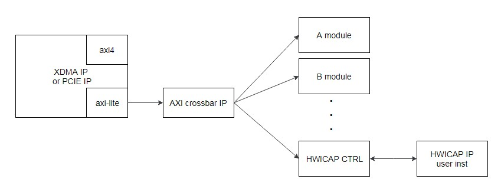

ICAP组件的集成开发指导
=======

[Switch to the English version](./README.md)

本章节主要介绍如何集成华为的ICAP组件到用户工程之中。

目录
-------
[简介](#a)

[产品规格](#b)

[组件集成方法](#c)

[附录](#d)

<a name="a"></a>
简介
-------
###Release 1.1
- 组件初始版本，版本信息：0x19E50011。

###组件功能
华为向用户提供了ICAP组件（DCP类型），例化该组件的逻辑就可以使用warmboot功能，即在不下电OS的情况下实现从FLASH中升级逻辑的功能。该组件采用了AXI-LITE协议接口。

###组件下载地址
用户可以从下面的网址下载该组件dcp：
<https://huawei-fpga.obs.cn-north-1.myhwclouds.com/FX600/hardware/hw_platform/component/ICAP/v1.1/hwicap_top.dcp>

如果是在linux系统上， 可以使用以下命令下载：

```bash
curl -k -s -O --retry 3 https://huawei-fpga.obs.cn-north-1.myhwclouds.com/FX600/hardware/hw_platform/component/ICAP/v1.1/hwicap_top.dcp
```

<a name="b"></b>

产品规格
--------

### 使用范围
华为FX600 FPGA加速卡。组件DCP 采用vivado 2017.2编译，用户工程不能低于该版本。

###速度
使用配套工具进行reload操作时，逻辑生效一般需要3~5分钟。

### 资源占用情况
ICAP组件DCP综合后的资源占用情况如下表所示。

| Resource | Utilization |
| -------- | ----------- |
| LUT      | 764         |
| FF       | 1313        |
| BRAM     | 1.50        |
| BUFG     | 2           |


### 组件版本信息
访问组件版本信息寄存器，可以获得组件版本信息。访问地址格式为 *基地址+偏移地址*（偏移地址0xC00；基地址用户自行分配，分配原则参考下面*“组件基地址分配”*章节描述）。以初始版本组件为例，如果访问组件版本信息寄存器，得到的结果为0x19E50011，则可以初步判断组件集成成功。

###组件接口描述
**注意：**复位信号是高电平有效。

| 信号名称               | 接口类型 | 位宽   | I/O  | 初始状态 | 描述                                       |
| ---------------------- | -------- | ------ | ---- | -------- | ------------------------------------------ |
| HWICAP   信号          |          |        |      |          |                                            |
| aclk                   | NA       | [0:0]  | I    | -        | 组件内时钟信号                             |
| areset                 | NA       | [0:0]  | I    | -        | 组件内复位信号，高电平有效                 |
| reg_icap_recovery_cfg  | NA       | [0:0]  | O    | 0        | 送往pcie，利用pcie复位icap的信号；暂不使用 |
| HWICAP IP AXI-LITE接口 |          |        |      |          |                                            |
| hwicap_eos_in          | NA       | [0:0]  | O    | -        | 启动结束信号                               |
| hwicap_aclk_lite       | AXI-LITE | [0:0]  | O    | -        | axi-lite通道时钟信号                       |
| hwicap_aresetn_lite    | AXI-LITE | [0:0]  | O    | -        | axi-lite通道复位信号                       |
| hwicap_axi_awaddr      | AXI-LITE | [8:0]  | O    | -        | 写地址通道addr信号                         |
| hwicap_axi_awvalid     | AXI-LITE | [0:0]  | O    | -        | 写地址通道valid信号                        |
| hwicap_axi_awready     | AXI-LITE | [0:0]  | I    | -        | 写地址通道ready信号                        |
| hwicap_axi_wdata       | AXI-LITE | [31:0] | O    | -        | 写数据通道data信号                         |
| hwicap_axi_wstrb       | AXI-LITE | [3:0]  | O    | -        | 写数据通道wstrb信号                        |
| hwicap_axi_wvalid      | AXI-LITE | [0:0]  | O    | -        | 写数据通道valid信号                        |
| hwicap_axi_wready      | AXI-LITE | [0:0]  | I    | -        | 写数据通道ready信号                        |
| hwicap_axi_bresp       | AXI-LITE | [1:0]  | I    | -        | 响应通道resp信号                           |
| hwicap_axi_bvalid      | AXI-LITE | [0:0]  | I    | -        | 响应通道valid信号                          |
| hwicap_axi_bready      | AXI-LITE | [0:0]  | O    | -        | 响应通道ready信号                          |
| hwicap_axi_araddr      | AXI-LITE | [8:0]  | O    | -        | 读地址通道addr信号                         |
| hwicap_axi_arvalid     | AXI-LITE | [0:0]  | O    | -        | 读数据通道valid信号                        |
| hwicap_axi_arready     | AXI-LITE | [0:0]  | I    | -        | 读数据信号ready信号                        |
| hwicap_axi_rdata       | AXI-LITE | [31:0] | I    | -        | 读数据通道data信号                         |
| hwicap_axi_rresp       | AXI-LITE | [1:0]  | I    | -        | 读数据通道resp信号                         |
| hwicap_axi_rvalid      | AXI-LITE | [0:0]  | I    | -        | 读地址通道valid信号                        |
| hwicap_axi_rready      | AXI-LITE | [0:0]  | O    | -        | 读地址信号ready信号                        |
| hwicap_ip2intc_irpt    | NA       | [0:0]  | I    | -        | hwicap中断信号                             |
| hwicap_prdone          | NA       | [0:0]  | I    | -        | 保留信号暂不使用，用户可以给固定值1'b1     |
| hwicap_prerror         | NA       | [0:0]  | I    | -        | 保留信号暂不使用，用户可以给固定值1'b0     |
| USER AXI-LITE 接口     |          |        |      |          |                                            |
| awvalid                | AXI-LITE | [0:0]  | I    | -        | 写地址通道valid信号                        |
| awaddr                 | AXI-LITE | [31:0] | I    | -        | 写地址通道addr信号                         |
| awready                | AXI-LITE | [0:0]  | O    | -        | 写地址通道ready信号                        |
| wvalid                 | AXI-LITE | [0:0]  | I    | -        | 写数据通道valid信号                        |
| wdata                  | AXI-LITE | [31:0] | I    | -        | 写数据通道data信号                         |
| wstrb                  | AXI-LITE | [3:0]  | I    | -        | 写数据通道wstrb信号                        |
| wready                 | AXI-LITE | [0:0]  | O    | -        | 写数据通道ready信号                        |
| bvalid                 | AXI-LITE | [0:0]  | O    | -        | 响应通道valid信号                          |
| bresp                  | AXI-LITE | [1:0]  | O    | -        | 响应通道resp信号                           |
| bready                 | AXI-LITE | [0:0]  | I    | -        | 响应通道ready信号                          |
| arvalid                | AXI-LITE | [0:0]  | I    | -        | 读地址通道valid信号                        |
| araddr                 | AXI-LITE | [31:0] | I    | -        | 读地址通道addr信号                         |
| arready                | AXI-LITE | [0:0]  | O    | -        | 读地址信号ready信号                        |
| rvalid                 | AXI-LITE | [0:0]  | O    | -        | 读数据通道valid信号                        |
| rdata                  | AXI-LITE | [31:0] | O    | -        | 读数据通道data信号                         |
| rresp                  | AXI-LITE | [1:0]  | O    | -        | 读数据通道resp信号                         |
| rready                 | AXI-LITE | [0:0]  | I    | -        | 读数据信号ready信号                        |


<a name="c"></c>

组件集成方法
--------

###组件连接参考方案
由于组件采用了axi-lite接口，所以需要挂载在pcie的axi-lite总线上。参考连接方式如下图所示，pcie模块或者是xdma模块只有一路axi-lite接口，所以后级需要使用axi crossbar这类IP或模块，将一路axi-lite master接口，扩展为多个axi-lite master接口，然后再和组件连接。
另外，考虑兼容性问题，需要用户使用自己的Vivado版本例化Xilinx HWICAP IP，例化后的IP的管脚和上面信号列表中HWICAP IP接口信号一一对应连接即可（IP的icap_clk信号需要用户提供，接100MHz时钟）。



###组件例化方法
打开vivado工程，点击add source添加dcp到工程内，然后参考下面的verilog 代码，在代码中需要的位置例化该组件即可。注意例化组件的接口要和dcp里的接口信号完全一致。

```verilog
hwicap_top hwicap_axi_top
(
    .aclk                 (axil_aclk           ),  //input  wire        aclk        
    .areset               (axil_areset         ),  //input  wire        areset , high active
    .reg_icap_recovery_cfg(                    ),  //output wire        reg_icap_recovery_cfg

    //hwicap IP axi-lite interface
    .hwicap_eos_in        (hwicap_eos_in       ),// output wire eos_in 

    .hwicap_aclk_lite     (hwicap_axil_aclk    ),// output wire s_axi_aclk
    .hwicap_aresetn_lite  (hwicap_axil_aresetn ),// output wire s_axi_aresetn
    .hwicap_axi_awaddr    (hwicap_axil_awaddr  ),// output wire [8 : 0] s_axi_awaddr
    .hwicap_axi_awvalid   (hwicap_axil_awvalid ),// output wire s_axi_awvalid
    .hwicap_axi_awready   (hwicap_axil_awready ),// input wire s_axi_awready
    .hwicap_axi_wdata     (hwicap_axil_wdata   ),// output wire [31 : 0] s_axi_wdata
    .hwicap_axi_wstrb     (hwicap_axil_wstrb   ),// output wire [3 : 0] s_axi_wstrb
    .hwicap_axi_wvalid    (hwicap_axil_wvalid  ),// output wire s_axi_wvalid
    .hwicap_axi_wready    (hwicap_axil_wready  ),// input wire s_axi_wready
    .hwicap_axi_bresp     (hwicap_axil_bresp   ),// input wire [1 : 0] s_axi_bresp
    .hwicap_axi_bvalid    (hwicap_axil_bvalid  ),// input wire s_axi_bvalid
    .hwicap_axi_bready    (hwicap_axil_bready  ),// output wire s_axi_bready
    .hwicap_axi_araddr    (hwicap_axil_araddr  ),// output wire [8 : 0] s_axi_araddr
    .hwicap_axi_arvalid   (hwicap_axil_arvalid ),// output wire s_axi_arvalid
    .hwicap_axi_arready   (hwicap_axil_arready ),// input wire s_axi_arready
    .hwicap_axi_rdata     (hwicap_axil_rdata   ),// input wire [31 : 0] s_axi_rdata
    .hwicap_axi_rresp     (hwicap_axil_rresp   ),// input wire [1 : 0] s_axi_rresp
    .hwicap_axi_rvalid    (hwicap_axil_rvalid  ),// input wire s_axi_rvalid
    .hwicap_axi_rready    (hwicap_axil_rready  ),// output wire s_axi_rready
    .hwicap_ip2intc_irpt  (hwicap_ip2intc_irpt ),// input wire ip2intc_irpt

    .hwicap_prdone        (1'b1                ),//rsv interface, input wire
    .hwicap_prerror       (1'b0                ),//rsv interface, input wire  

    //pcie axi-lite interface                                   
    .awvalid              (axil_awvalid        ),//input  wire        awvalid     
    .awaddr               (axil_awaddr         ),//input  wire [31:0] awaddr      
    .awready              (axil_awready        ),//output wire        awready     
    .wvalid               (axil_wvalid         ),//input  wire        wvalid      
    .wdata                (axil_wdata          ),//input  wire [31:0] wdata       
    .wstrb                (axil_wstrb          ),//input  wire [3:0]  wstrb       
    .wready               (axil_wready         ),//output wire        wready                               
    .bvalid               (axil_bvalid         ),//output wire        bvalid      
    .bresp                (axil_bresp          ),//output wire [1:0]  bresp       
    .bready               (axil_bready         ),//input  wire        bready      
                                   
    .arvalid              (axil_arvalid        ),//input  wire        arvalid     
    .araddr               (axil_araddr         ),//input  wire [31:0] araddr      
    .arready              (axil_arready        ),//output wire        arready                              
    .rvalid               (axil_rvalid         ),//output wire        rvalid      
    .rdata                (axil_rdata          ),//output wire [31:0] rdata       
    .rresp                (axil_rresp          ),//output wire [1:0]  rresp       
    .rready               (axil_rready         ) //input  wire        rready  
);
```


###工程设置

####输入时钟
- 时钟来源：该组件的时钟需要使用外部管脚时钟。这是因为在逻辑warmboot过程中，PCIE IP会被复位导致其输出的时钟信号无效，如果使用PCIE IP输出的时钟，会导致ICAP组件无法在warmboot过程中正常工作。*工程约束*章节中描述的AY23、BA23管脚，会输入差分钟，用户只需要将差分钟转换为单端钟来使用，详细可以参考组件样例工程。
- 时钟频率：aclk接口的时钟，供组件内部处理PCIE AXI-LITE总线输入的数据使用，建议设置100MHz或者200MHz；
- Xilinx HWICAP IP时钟：用户需要自行例化该IP，IP接口有2个时钟输入接口：s_axi_aclk时钟接口与组件的hwicap_aclk_lite接口相连接，无需用户提供时钟；icap_clk时钟接口需要用户自行提供**100MHz**时钟，同时在例化HWICAP IP时勾选**Enable Async**选项（跨时钟域处理）。

**注意：**组件的areset复位信号是高电平有效 。

####输入复位信号
- 复位信号来源：该组件的复位信号需要使用外部管脚复位。这是因为在逻辑warmboot过程中，PCIE IP会被复位导致其输出的复位信号不稳定，如果使用PCIE IP输出的复位信号，会导致ICAP组件无法在warmboot过程中正常工作。*工程约束*章节中描述的AR26管脚，会输入低电平有效的管脚复位信号，详细可以参考组件样例工程。

####组件基地址分配
用户需要给组件分配基地址，一般是通过axi crossbar或者axi smartconnect这类axi路由模块完成的，这类模块会将axi地址的高位与用户设置的基地址进行匹配判断，然后根据结果将axi信号路由给后级的各个模块。由于ICAP组件内部使用了地址的低14bit，所以用户分配的基地址不能占用低14bit，例如0x8000是正确基地址，0x6000是错误的基地址（占用了bit13）。

**注意：**该组件占用了4Kbytes的地址空间，用户分配的基地址加上组件占用地址空间之和不能大于PCIE BAR空间的地址上限。例如，假设BAR空间只有64K大小，那么基地址就不能大于0xF000。

####例化Xilinx HWICAP IP
由于组件要使用Xilinx的HWICAP IP，为了保证用户在使用不同的Vivado版本编译时不会出现兼容性问题，组件内没有例化Xilinx的HWICAP IP，需要用户使用自己的Vivado版本例化该IP。例化之后，IP的管脚和上面信号列表中HWICAP IP接口信号一一对应连接即可。

例化方法：

1. 在Vivado工程界面左边的project manager中，点击IP Catalog，在其中搜索 hwicap，双击打开hwicap条目；

2. 在弹出的IP设置界面中，如下图所示，点击 *Advance*选项卡，勾选其中的*Enable Async*，点击确定。另外，可以看到IP有icap_clk接口，用户需要自行给该接口提供100MHz时钟；


3. 最后选择Global generate，生成IP即可。

####Device ID设置
为了避免用户逻辑的PCIE Device ID与华为其他设备冲突，同时也为了方便组件配套软硬件工具识别用户逻辑，推荐用户使用的Devcie ID设置如下图所示：


####工程约束
由于ICAP组件需要使用管脚时钟和管脚复位，所以xdc文件中需要约束相关管脚和电平，如下面代码所示。
```tcl
set_property PACKAGE_PIN AR26 [get_ports sys_rst_n]
set_property IOSTANDARD LVCMOS12 [get_ports sys_rst_n]

set_property PACKAGE_PIN AY23 [get_ports pin_sys_clk_p]
set_property PACKAGE_PIN BA23 [get_ports pin_sys_clk_n]
set_property IOSTANDARD LVDS [get_ports pin_sys_clk_p]
set_property IOSTANDARD LVDS [get_ports pin_sys_clk_n]
```
xdc中的其他约束设置，参考《FX600 开发者指南》中的*“管脚约束文件参考”*章节即可。
《FX600 开发者指南》可以在华为support网站下载，地址：
<https://support.huawei.com/enterprise/zh/doc/EDOC1100053259>


###配套软件工具
需要配套使用华为提供的FMTK软件工具，操作流程参考《FX600 用户指南》中*“3.2 安装和升级FMTK工具”*以及*“7.12 指定 FPGA 卡从特定区域启动”*章节。
《FX600 用户指南》可以在华为support网站下载，地址：
<https://support.huawei.com/enterprise/zh/doc/EDOC1100053260>

<a name="d"></c>

附录
--------
Xilinx HWICAP IP相关内容，可参考Xilinx官网文档PG134：
<https://www.xilinx.com/support/documentation/ip_documentation/axi_hwicap/v3_0/pg134-axi-hwicap.pdf>