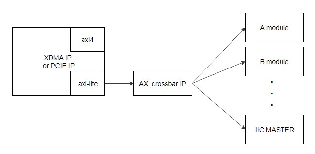

MCU_MST Component Integration Development Guide
=======

[切换到中文版](./README_CN.md)

This chapter describes how to integrate Huawei's MCU_MST components into a user project.

Contents
-------
[Overview](#a)

[Component Specifications](#b)

[Component Integration Method](#c)

<a name="a"></a>
Overview
-------
###Release 1.1
- This is the initial version of the component. The version information is 0x19E50311.

###Component Function
Huawei provides the MCU_MST component (DCP type). After this component is instantiated, you can use the FMTK tool provided by Huawei to access the MCU to obtain the accelerator card system status information. This component uses AXI-Lite interfaces.

###Component Download Address
You can download the component DCP file from the following website:
<https://huawei-fpga.obs.cn-north-1.myhwclouds.com/FX600/hardware/hw_platform/component/MCU_MST/v1.1/iic_master_top.dcp>

On Linux, run the following command to download the file:

```bash
curl -k -s -O --retry 3 https://huawei-fpga.obs.cn-north-1.myhwclouds.com/FX600/hardware/hw_platform/component/MCU_MST/v1.1/iic_master_top.dcp
```

<a name="b"></b>

Component Specifications
--------

###Usage Scope
This component is used for Huawei's FX600 FPGA accelerator card. The component DCP file uses Vivado 2017.2 for compilation. Users' version cannot be earlier than this version.

###Speed
The data is received in real time when the tool is invoked to query the accelerator card information. No speed problem is involved.

###Resource Utilization

The following table describes the resource utilization of the MCU_MST component after DCP integration.

| Resource | Utilization |
| -------- | ----------- |
| LUT      | 1134        |
| FF       | 1202        |
| BRAM     | 106         |
| BUFG     | 1           |

###Component Version Information
Access the component version information register to obtain the component version information. The access address format is *base address + offset address*. (The offset address is 0xC00, and the base address is allocated by users. For details about the allocation principles, see the *"Component Base Address Allocation"* section.) For example, when the initial version component is used, if the value in the component version information register is 0x19E50311, the component integration is successful.

###Component Interfaces

**Note:** The reset signal is effective when at high level. Two pins of the IIC need to be configured. Set the iic_master_sda pin to inout signal type, and the iic_master_scl pin to the output signal type.

| Signal Name         | Interface Type | Width  | I/O  | Initial Status | Description                              |
| ------------------- | -------------- | ------ | ---- | -------------- | ---------------------------------------- |
| IIC   MASTER signal |                |        |      |                |                                          |
| aclk                | N/A            | [0:0]  | I    | -              | AXI-Lite clock signal                    |
| areset              | N/A            | [0:0]  | I    | -              | AXI-Lite reset signal (effective when at high level) |
| iic_master_sda      | N/A            | [0:0]  | I/O  | -              | IIC MASTER sda signal                    |
| iic_master_scl      | N/A            | [0:0]  | O    | -              | IIC MASTER scl signal                    |
| AXI-Lite bus signal |                |        |      |                |                                          |
| awvalid             | AXI-Lite       | [0:0]  | I    | -              | Write address channel valid signal       |
| awaddr              | AXI-Lite       | [31:0] | I    | -              | Write address channel addr signal        |
| awready             | AXI-Lite       | [0:0]  | O    | -              | Write address channel ready signal       |
| wvalid              | AXI-Lite       | [0:0]  | I    | -              | Write data channel valid signal          |
| wdata               | AXI-Lite       | [31:0] | I    | -              | Write data channel data signal           |
| wstrb               | AXI-Lite       | [3:0]  | I    | -              | Write data channel wstrb signal          |
| wready              | AXI-Lite       | [0:0]  | O    | -              | Write data channel ready signal          |
| bvalid              | AXI-Lite       | [0:0]  | O    | -              | Response channel valid signal            |
| bresp               | AXI-Lite       | [1:0]  | O    | -              | Response channel resp signal             |
| bready              | AXI-Lite       | [0:0]  | I    | -              | Response channel ready signal            |
| arvalid             | AXI-Lite       | [0:0]  | I    | -              | Read address channel valid signal        |
| araddr              | AXI-Lite       | [31:0] | I    | -              | Read address channel addr signal         |
| arready             | AXI-Lite       | [0:0]  | O    | -              | Read address channel ready signal        |
| rvalid              | AXI-Lite       | [0:0]  | O    | -              | Read data channel valid signal           |
| rdata               | AXI-Lite       | [31:0] | O    | -              | Read data channel data signal            |
| rresp               | AXI-Lite       | [1:0]  | O    | -              | Read data channel resp signal            |
| rready              | AXI-Lite       | [0:0]  | I    | -              | Read data channel ready signal           |

<a name="c"></c>

Component Integration Method
--------

###Reference Solution for Component Connection
This component uses AXI-Lite interfaces. Therefore, the component must be mounted to the PCIe AXI-Lite bus. The following figure shows the reference connection method. The PCIe or XDMA module has only one AXI-Lite interface. You need to extend one AXI-Lite Master interface into multiple AXI-Lite Master interfaces by using an IP core or module (such as AXI Crossbar), and connect the interfaces to the component.



###Component Instantiation Method
Open a Vivado project, click add source to add the DCP file to the project, and instantiate the component at required positions in the code by referring to the following verilog code. Ensure that the interfaces of the instantiated component are the same as the signal interfaces in the DCP file.

```verilog
iic_master_top u_iic_master_top_0
(
    //globe signal
    .areset                    ( axil_reset           ),          
    .aclk                      ( axil_aclk            ), 

    // axi4 lite slave signals
    .awvalid                   ( axil_awvalid         ),
    .awaddr                    ( axil_awaddr          ),
    .awready                   ( axil_awready         ),
    .wvalid                    ( axil_wvalid          ),
    .wdata                     ( axil_wdata           ),
    .wstrb                     ( axil_wstrb           ),
    .wready                    ( axil_wready          ),
    .bvalid                    ( axil_bvalid          ),
    .bresp                     ( axil_bresp           ),
    .bready                    ( axil_bready          ),
    
    .arvalid                   ( axil_arvalid         ),
    .araddr                    ( axil_araddr          ),
    .arready                   ( axil_arready         ),
    .rvalid                    ( axil_rvalid          ),
    .rdata                     ( axil_rdata           ),
    .rresp                     ( axil_rresp           ),
    .rready                    ( axil_rready          ),
    
    //iic signals
    .iic_master_sda            ( iic_master_sda       ),
    .iic_master_scl            ( iic_master_scl       )  
);
```


###Project Settings

####Input Clock
If the frequency of the component clock (aclk) is too high or too low, the timing of the MCU_MST interface may not meet the requirement. Therefore, set the frequency to **200MHz**.

####Base Address Allocation
You need to allocate a base address to the component by using AXI routing modules such as AXI Crossbar or AXI SmartConnect. These modules match the upper bits of AXI addresses with the base address set by users to determine the target modules of the AXI signals. The MCU_MST component uses the lower 14 bits of the address. Therefore, the base address allocated by users cannot occupy the lower 14 bits. For example, 0x8000 is a correct base address, and 0x6000 is an incorrect base address (bit 13 is occupied).
**Note:**  This component uses the address space of the 4 Kbytes. The sum of the base address allocated by the user and the address space used by the component cannot be greater than the upper limit of the address space of the PCIe BAR. For example, if the BAR space is 64 KB, the base address cannot be greater than 0xF000.

####Device ID Settings
To avoid ID conflict between user logic PCIe devices and other Huawei devices and facilitate user logic identification by software and hardware tools of the component, you are advised to use the following device ID settings.


####Constraints
This component needs to restrict the position and level of the two IIC pins. The constraints are as follows:

```tcl
  set_property PACKAGE_PIN AV22     [get_ports iic_master_scl]
  set_property PACKAGE_PIN BF22     [get_ports iic_master_sda]
  set_property IOSTANDARD  LVCMOS18 [get_ports iic_master_scl]
  set_property IOSTANDARD  LVCMOS18 [get_ports iic_master_sda]
```

For details about other constraints in the XDC file, see the *"Pin Constraint File Reference"* section in the FX600 Developer Guide.
Download the FX600 Developer Guide from the Huawei support website:
<https://support.huawei.com/enterprise/zh/doc/EDOC1100053259>

###Tools
Use the FMTK tool provided by Huawei. For details about how to use the tool, see section 3.2 "Software Tool Installation and Upgrade" and chapter 7 "Tool Command Description" in the *FX600 User Guide*.
Download the FX600 User Guide from the Huawei support website:
<https://support.huawei.com/enterprise/zh/doc/EDOC1100053260>


