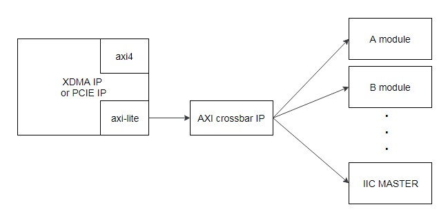

MCU_MST组件的集成开发指导
=======

[Switch to the English version](./README.md)

本章节主要介绍如何集成华为的MCU_MST组件到用户工程之中。

目录
-------
[简介](#a)

[产品规格](#b)

[组件集成方法](#c)

<a name="a"></a>

简介
-------
###Release 1.1
- 组件初始版本，版本信息：0x19E50311。

###组件功能
华为向用户提供了MCU_MST组件（DCP类型），例化该组件后，配套华为的FMTK工具可以带内访问MCU获取加速卡系统状态信息。该组件采用了AXI-LITE协议接口。

###组件下载地址
用户可以从下面的网址下载该组件dcp：
<https://huawei-fpga.obs.cn-north-1.myhwclouds.com/FX600/hardware/hw_platform/component/MCU_MST/v1.1/iic_master_top.dcp>

如果是在linux系统上， 可以使用以下命令下载：

```bash
curl -k -s -O --retry 3 https://huawei-fpga.obs.cn-north-1.myhwclouds.com/FX600/hardware/hw_platform/component/MCU_MST/v1.1/iic_master_top.dcp
```

<a name="b"></b>

产品规格
--------

### 使用范围
华为FX600 FPGA加速卡。组件DCP 采用vivado 2017.2编译，用户工程不能低于该版本。

###速度
使用工具调用组件查询加速卡信息时即时收到数据，不涉及速度问题。

### 资源占用情况

MCU_MST组件DCP综合后的资源占用情况如下表所示。

| Resource | Utilization |
| -------- | ----------- |
| LUT      | 1134        |
| FF       | 1202        |
| BRAM     | 106         |
| BUFG     | 1           |

### 组件版本信息
访问组件版本信息寄存器，可以获得组件版本信息。访问地址格式为 *基地址+偏移地址*（偏移地址0xC00；基地址用户自行分配，分配原则参考下面*“组件基地址分配”*章节描述）。以初始版本组件为例，如果访问组件版本信息寄存器，得到的结果为0x19E50311，则可以初步判断组件集成成功。

###组件接口描述

**注意：**复位信号是高电平有效；IIC的两个管脚，iic_master_sda要定义为inout信号类型，iic_master_scl要定义为output信号类型。

| 信号名称            | 接口类型     | 位宽     | I/O  | 初始状态 | 描述               |
| --------------- | -------- | ------ | ---- | ---- | ---------------- |
| IIC   MASTER 信号 |          |        |      |      |                  |
| aclk            | NA       | [0:0]  | I    | -    | AXI-LITE时钟信号     |
| areset          | NA       | [0:0]  | I    | -    | AXI-LITE复位信号，高有效 |
| iic_master_sda  | NA       | [0:0]  | IO   | -    | IIC MASTER sda信号 |
| iic_master_scl  | NA       | [0:0]  | O    | -    | IIC MASTER scl信号 |
| AXI-LITE   总线信号 |          |        |      |      |                  |
| awvalid         | AXI-LITE | [0:0]  | I    | -    | 写地址通道valid信号     |
| awaddr          | AXI-LITE | [31:0] | I    | -    | 写地址通道addr信号      |
| awready         | AXI-LITE | [0:0]  | O    | -    | 写地址通道ready信号     |
| wvalid          | AXI-LITE | [0:0]  | I    | -    | 写数据通道valid信号     |
| wdata           | AXI-LITE | [31:0] | I    | -    | 写数据通道data信号      |
| wstrb           | AXI-LITE | [3:0]  | I    | -    | 写数据通道wstrb信号     |
| wready          | AXI-LITE | [0:0]  | O    | -    | 写数据通道ready信号     |
| bvalid          | AXI-LITE | [0:0]  | O    | -    | 响应通道valid信号      |
| bresp           | AXI-LITE | [1:0]  | O    | -    | 响应通道resp信号       |
| bready          | AXI-LITE | [0:0]  | I    | -    | 响应通道ready信号      |
| arvalid         | AXI-LITE | [0:0]  | I    | -    | 读地址通道valid信号     |
| araddr          | AXI-LITE | [31:0] | I    | -    | 读地址通道addr信号      |
| arready         | AXI-LITE | [0:0]  | O    | -    | 读地址信号ready信号     |
| rvalid          | AXI-LITE | [0:0]  | O    | -    | 读数据通道valid信号     |
| rdata           | AXI-LITE | [31:0] | O    | -    | 读数据通道data信号      |
| rresp           | AXI-LITE | [1:0]  | O    | -    | 读数据通道resp信号      |
| rready          | AXI-LITE | [0:0]  | I    | -    | 读数据信号ready信号     |

<a name="c"></c>

组件集成方法
--------

###组件连接参考方案
由于组件采用了axi-lite接口，所以需要挂载在pcie的axi-lite总线上。参考连接方式如下图所示，pcie模块或者是xdma模块只有一路axi-lite接口，所以后级需要使用axi crossbar这类IP或模块，将一路axi-lite master接口，扩展为多个axi-lite master接口，然后再和组件连接。



###组件例化方法
打开vivado工程，点击add source添加dcp到工程内，然后参考下面的verilog 代码，在代码中需要的位置例化该组件即可。注意例化组件的接口要和dcp里的接口信号完全一致。

```verilog
iic_master_top u_iic_master_top_0
(
    //globe signal
    .areset                    ( axil_reset           ),          
    .aclk                      ( axil_aclk            ), 

    // axi4 lite slave signals
    .awvalid                   ( axil_awvalid         ),
    .awaddr                    ( axil_awaddr          ),
    .awready                   ( axil_awready         ),
    .wvalid                    ( axil_wvalid          ),
    .wdata                     ( axil_wdata           ),
    .wstrb                     ( axil_wstrb           ),
    .wready                    ( axil_wready          ),
    .bvalid                    ( axil_bvalid          ),
    .bresp                     ( axil_bresp           ),
    .bready                    ( axil_bready          ),
    
    .arvalid                   ( axil_arvalid         ),
    .araddr                    ( axil_araddr          ),
    .arready                   ( axil_arready         ),
    .rvalid                    ( axil_rvalid          ),
    .rdata                     ( axil_rdata           ),
    .rresp                     ( axil_rresp           ),
    .rready                    ( axil_rready          ),
    
    //iic signals
    .iic_master_sda            ( iic_master_sda       ),
    .iic_master_scl            ( iic_master_scl       )  
);
```


###工程设置

####输入时钟
组件时钟（aclk）频率过高或过低都可能会导致MCU_MST接口时序不满足要求，所以必须采用**200MHz**。

####组件基地址分配
用户需要给组件分配基地址，一般是通过axi crossbar或者axi smartconnect这类axi路由模块完成的，这类模块会将axi地址的高位与用户设置的基地址进行匹配判断，然后根据结果将axi信号路由给后级的各个模块。由于MCU_MST组件内部使用了地址的低14bit，所以用户分配的基地址不能占用低14bit，例如0x8000是正确基地址，0x6000是错误的基地址（占用了bit13）。

**注意：**该组件占用了4Kbytes的地址空间，用户分配的基地址加上组件占用地址空间之和不能大于PCIE BAR空间的地址上限。例如，假设BAR空间只有64K大小，那么基地址就不能大于0xF000。

####Device ID设置
为了避免用户逻辑的PCIE Device ID与华为其他设备冲突，同时也为了方便组件配套软硬件工具识别用户逻辑，推荐用户使用的Devcie ID设置如下图所示：


####工程约束
该组件需要约束两个IIC管脚的位置与电平，约束参考如下：

```tcl
  set_property PACKAGE_PIN AV22     [get_ports iic_master_scl]
  set_property PACKAGE_PIN BF22     [get_ports iic_master_sda]
  set_property IOSTANDARD  LVCMOS18 [get_ports iic_master_scl]
  set_property IOSTANDARD  LVCMOS18 [get_ports iic_master_sda]
```

xdc中的其他约束设置，参考《FX600 开发者指南》中的*“管脚约束文件参考”*相关章节即可。
《FX600 开发者指南》可以在华为support网站下载，地址：
<https://support.huawei.com/enterprise/zh/doc/EDOC1100053259>

###配套软件工具
需要配套使用华为提供的FMTK软件工具，操作流程参考《FX600 用户指南》中的*“3.2 安装和升级FMTK工具”*以及*“7 工具命令行说明”*章节。
《FX600 用户指南》可以在华为support网站下载，地址：
<https://support.huawei.com/enterprise/zh/doc/EDOC1100053260>