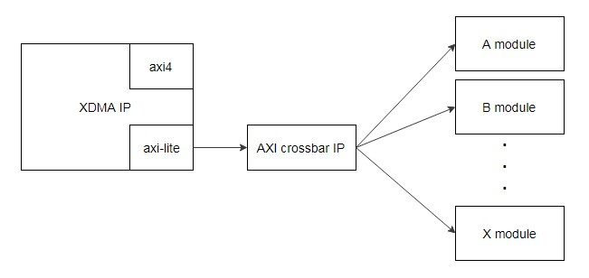
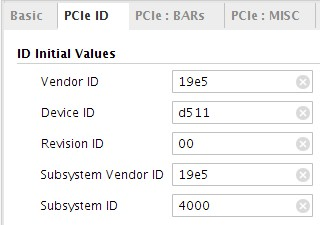
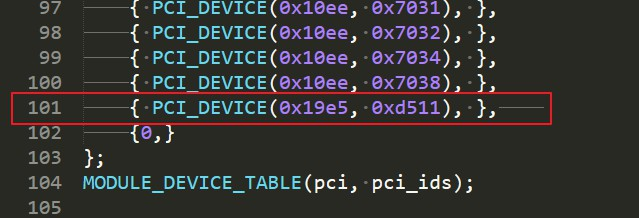

Example Project Usage
=======

[切换到中文版](./README_CN.md)

Contents
-------
[Overview](#a)

[Download Address](#b)

[Example Project Usage](#c)

[xdma Driver Usage](#d).

[Precautions](#e)

[Reference Document](#f)

<a name="a"></a>

Overview
-------

###Release 1.0
- This is the initial version of the example project.

###Function of the Example Project
The example project uses the XDMA IP core and AXI Crossbar IP core of Xilinx to integrate multiple open components of Huawei. All component interfaces are AXI-Lite interfaces. You can refer to the connection method in the example project.

** Note: ** Download the DCP files of the FLASH, ICAP, and MCU_MST components as required and add them to the sample project. Add the three DCP files to the **imports** folder in the sample project to replace the original DCP files. For details about how to add other components, see section "Adding Components."

<a name="b"></b>

Download Address
--------

Download the example project package from the following website:
<https://huawei-fpga.obs.cn-north-1.myhwclouds.com/FX600/hardware/hw_platform/component/component_example_prj/component_example_prj.zip>

On Linux, run the following command to download the project package:

```bash
curl -k -s -O --retry 3 https://huawei-fpga.obs.cn-north-1.myhwclouds.com/FX600/hardware/hw_platform/component/component_example_prj/component_example_prj.zip
```

<a name="c"></c>

Example Project Usage
--------
###Project Connection Diagram
The following figure shows the module connection structure of the example project.



The top-level code of the project is xilinx_dma_pcie_ep.sv in the imports folder. In the top-level code, the AXI Crossbar IP core is used to extend the AXI-Lite interface route output by the XDMA IP core to five AXI-Lite Master interfaces. The components are mounted under these AXI-Lite interfaces.

###Cross-Clock-Domain Processing
Different components require different input clock frequencies. Therefore, clock signals need to be processed across domains, and AXI-Lite data output by the PCIE IP core needs to be processed across clock domains.
- Cross-clock-domain processing of clock signals: You can use the Xilinx Clock Wizard IP core. In the example project, a 100 MHz clock signal is input to the IP core, and the IP core can output the 200 MHz clock.
- Cross-clock-domain processing of AXI-Lite data: You can use Xilinx AXI Clock Converter IP core. Input a 250 MHz and a 200 MHz clock signals to the IP core and set *aclk asynchronous* to yes on the IP core configuration window for the IP core to automatically perform cross-domain processing. In the example project, input the AXI-Lite data in the 250 MHz clock domain to the IP core. The IP core outputs the AXI-Lite data in the 200 MHz clock domain.

###Base Address Allocation:
- The base addresses of the five AXI-Lite interfaces are 0x104000, 0x108000, 0x10c000, 0x110000, and 0x114000. (Double-click CROSSBAR IP core on the Vivado project window and click the address tab to view the base addresses.)
- The 0x104000 base address is allocated to the XDMA APP IP core of Xilinx for data storage. This address is not used and is reserved only.
- The 0x108000 base address is allocated to the MCU_MST (IIC MASTER) component, the 0x10c000 base address is allocated to the FLASH component, and the 0x110000 base address is allocated to the ICAP component.
- The 0x114000 base address is allocated to the Xilinx AXI GPIO IP core. You can use the IP core as the version information register. For example, if the input value of the *gpio_io_i* interface in the xilinx_dma_pcie_ep.sv top-level code is changed to *32 'h20190225*, the value can be read by accessing the 0x114000 address register.

###Device ID Settings
To avoid ID conflict between user logic PCIe devices and other Huawei devices and facilitate user logic identification by software and hardware tools of the component, you are advised to use the following device ID settings (open XDMA IP core to set the parameters).



###Component Adding Method
To add a component to the example project, perform the following steps:
1. On the project window, click add source to add the component design checkpoint (DCP) file.
2. In the xilinx_dma_pcie_ep.sv top-level code, instantiate the component according to the description in the component integration guide.
3. Connect the AXI-Lite interface of the component to an idle interface of the five AXI-Lite interfaces of the Crossbar IP core.
4. In the Xilinx Design Constraints (XDC) file of the project, add component constraints according to the description in the component integration guide.

** Note: ** The example project contains the FLASH, ICAP, and MCU_MST components. Therefore, you do not need to perform the preceding steps to update the three components. You only need to place the DCP files of the three components in the **imports** folder of the project to replace the original DCP files. For other components that are not included in the sample project, perform the preceding steps.

<a name="d"></d>

## XDMA Driver Usage

The sample project uses the native XDMA IP of Xilinx. Therefore, you can use the XDMA driver of the Xilinx.

### Downloading the Driver

Version download URL:
<https://www.xilinx.com/support/answers/65444.html>
For Linux, download the **Xilinx_Answer_65444_Linux_Files.zip** file; for Windows, download the **Xilinx_Answer_65444_Windows_Files.zip** file.

### Installing the Driver

The following uses Linux as an example to describe how to install the driver:

1. Decompress the package and go to the driver directory.
2. Open the **xdma-core.c** file and add the device information of the user logic, for example, device 19e5:d511, as shown in the following figure.



3. In the driver directory, run the following command to compile the XDMA driver:

```makefile
make all
```

4. Go to the test directory and run the following command to compile the test tool:

```makefile
make all
```

5. In the test directory, run the following command to copy the driver to the /etc/ directory:

```bash
cp ../etc/udev/rules.d/* /etc/udev/rules.d/
```

6. In the test directory, run the following command to install the driver:

```bash
./load_driver.sh
```

### DMA Test

After the driver is installed, go to the test directory.

- DMA basic traffic test: Run the following command. After the test is complete, the message "test pass" is displayed.

```bash
./run_test.sh
```

- DMA performance test: Run the following command. After the test is complete, the following performance information is displayed:

```bash
./perform_hwcount.sh
```

### Driver Description

For details about how to install and use the driver, see readme.txt in the root directory of the compressed package and document PG195 on the official Xilinx website. (See Reference Documents.)

<a name="e"></e>

Precautions
--------
- The example project uses Vivado 2017.2 for compilation. On Vivado that is later than this version, you need to manually update the project.
- Constraints on the FLASH, ICAP, and MCU_MST components have been added to the project constraints. When other components are used, add constraints according to the component integration guide.
- The PCIe settings in the XDMA IP core meet the specifications of the FX600 accelerator card. You do not need to modify the settings.
- For other information about the FX600 accelerator card, see the FX600 User Guide and FX600 Developer Guide.
  Download the FX600 User Guide from the Huawei support website:
  <https://support.huawei.com/enterprise/zh/doc/EDOC1100053260>
  Download the FX600 Developer Guide from the Huawei support website:
  <https://support.huawei.com/enterprise/zh/doc/EDOC1100053259>

<a name="f"></f>

Reference Documents
--------
- For details about how to use the Xilinx DMA/Bridge subsystem (XDMA IP), see document PG195 on the official Xilinx website:
  <https://www.xilinx.com/support/documentation/ip_documentation/xdma/v4_1/pg195-pcie-dma.pdf>
- For details about how to use the Xilinx Clock Wizard IP core, see document PG065 on the official Xilinx website: 
  <https://www.xilinx.com/support/documentation/ip_documentation/clk_wiz/v6_0/pg065-clk-wiz.pdf>
- For details about how to use the Xilinx AXI Crossbar IP core, see document PG059 on the official Xilinx website:
  <https://www.xilinx.com/support/documentation/ip_documentation/axi_interconnect/v2_1/pg059-axi-interconnect.pdf>
- For details about how to use the Xilinx AXI Clock Converter IP core, see document PG059 on the official Xilinx website:
  <https://www.xilinx.com/support/documentation/ip_documentation/axi_interconnect/v2_1/pg059-axi-interconnect.pdf>
- For details about how to use the Xilinx AXI GPIO IP core, see document PG144 on the official Xilinx website.
  <https://www.xilinx.com/support/documentation/ip_documentation/axi_gpio/v2_0/pg144-axi-gpio.pdf>


