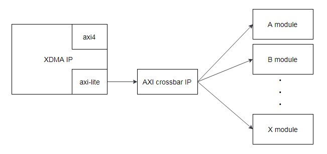

样例工程使用方法
=======

[Switch to the English version](./README.md)

目录
-------
[简介](#a)

[下载地址](#b)

[样例工程使用方法](#c)

[xdma驱动使用](#d)

[注意事项](#e)

[参考文档](#f)

<a name="a"></a>

简介
-------

###Release 1.0
- 样例工程初始版本。

###样例工程功能
该样例工程主要利用Xilinx的XDMA  IP和AXI Crossbar IP，集成了华为已开放的多个组件。所有组件接口为AXI-LITE接口，用户可以参考样例工程中的连接方法。

**注意：**用户根据自身需要下载相应版本的FLASH，ICAP，MCU_MST 三个组件DCP文件，并添加到样例工程之中。添加方法是将下载好的3个DCP文件放入样例工程中的imports文件夹中，替换原有的DCP文件。其他组件的添加方法，要参考下面*“组件添加方法”*章节。

<a name="b"></b>

下载地址
--------

用户可以从以下网址下载样例工程包：
<https://huawei-fpga.obs.cn-north-1.myhwclouds.com/FX600/hardware/hw_platform/component/component_example_prj/component_example_prj.zip>

如果是在linux系统上， 可以使用以下命令下载：

```bash
curl -k -s -O --retry 3 https://huawei-fpga.obs.cn-north-1.myhwclouds.com/FX600/hardware/hw_platform/component/component_example_prj/component_example_prj.zip
```

<a name="c"></c>

样例工程使用方法
--------
###工程连接简图
样例工程的模块连接结构简图如下所示：



工程顶层代码是imports文件夹中的xilinx_dma_pcie_ep.sv，顶层代码中使用AXI CROSSBAR IP将XDMA IP输出的一路AXI-LITE接口路由扩展为5个AXI-LITE master接口，几个组件就挂载在这些AXI-LITE接口之下。

###跨时钟域处理
由于不同组件需要的输入时钟频率不同，所以需要对时钟信号做跨时钟域处理，也需要对PCIE IP输出的AXI-LITE数据跨时钟域处理。
- 时钟信号跨时钟域处理：可以使用Xilinx Clock Wizard IP，以样例工程为例，向该IP输入了100MHz时钟，IP可以输出200MHz时钟。
- AXI-LITE数据跨时钟域处理：可以使用Xilinx AXI Clock Converter IP，给IP接口输入250MHz和200MHz的时钟信号，同时在IP设置界面，*aclk asynchronous*选项选择为yes，那么IP就会自动做跨时钟域处理。以样例工程为例，向IP输入250MHz时钟域下的AXI-LITE数据，IP输出了200MHz时钟域下的AXI-LITE数据。

###基地址分配：
- 5个AXI-LITE接口的基地址分别为0x104000，0x108000，0x10c000，0x110000，0x114000（Vivado工程界面双击CROSSBAR IP，在address选项卡可以看到）。
- 0x104000基地址分配给了xilinx的XDMA APP IP，功能是存储数据，当前没有使用仅保留；
- 0x108000基地址分配给了MCU_MST（IIC MASTER）组件，0x10c000基地址分配给了FLASH组件，0x110000基地址分配给了ICAP组件。
- 0x114000基地址分配给了Xilinx AXI GPIO IP，用户可以将该IP用作版本信息寄存器，例如，在顶层代码xilinx_dma_pcie_ep.sv中，修改*gpio_io_i*接口输入的数值为*32‘h20190225*，那么访问0x114000地址寄存器就可以读到该数值。

###Device ID设置
为了避免用户逻辑的PCIE Device ID与华为其他设备冲突，同时也为了方便组件配套软硬件工具识别用户逻辑，推荐用户使用的Devcie ID设置（打开XDMA IP进行设置），如下图所示：


###组件添加方法：
用户要在样例工程中添加组件的基本流程如下：
1. 在工程界面，点击 add source，添加组件dcp文件；
2. 在顶层代码xilinx_dma_pcie_ep.sv中，按照组件集成指导中的描述，代码例化组件；
3. 将组件的AXI-LITE接口，与CROSSBAR IP的5个AXI-LITE接口中的空闲接口连接；
4. 在工程的xdc约束文件中，按照组件集成指导中的描述，添加组件对应的约束。

**注意：**因为样例工程中已经包含了FLASH，ICAP，MCU_MST三个组件，所以更新这三个组件不需要执行上述流程，仅需要将三个组件的DCP文件放入工程imports文件夹中替换掉原有的DCP文件。其他样例工程未包含的组件，就必须按照上述流程操作。

<a name="d"></d>

XDMA驱动使用
--------
由于样例工程使用了Xilinx原生的XDMA IP，所以可以使用Xilinx配套的XDMA驱动。

###驱动下载
驱动下载地址如下：
<https://www.xilinx.com/support/answers/65444.html>
linux系统下载Xilinx_Answer_65444_Linux_Files.zip，windows系统下载Xilinx_Answer_65444_Windows_Files.zip。

###驱动安装
以linux为例，驱动安装流程如下：
1. 解压压缩包，进入driver目录。

2. 打开xdma-core.c，添加用户逻辑的设备信息，如下图示例，添加了19e5:d511这个设备：


3. 在driver目录中，执行下面的命令完成XDMA驱动编译：
```makefile
make all
```
4. 进入test目录，执行下面的命令完成测试工具编译：
```makefile
make all
```
5. 在test目录中，执行下面的命令，将驱动复制到系统/etc/文件夹中：
```bash
cp ../etc/udev/rules.d/* /etc/udev/rules.d/
```
6. 在test目录中，执行下面的命令完成驱动安装：
```bash
./load_driver.sh
```

###DMA测试
完成驱动安装之后，进入test目录中。
- DMA基础流量测试。执行下面的命令，测试结束会打印test pass：
```bash
./run_test.sh
```

- DMA性能测试。执行下面的命令，测试结束后会打印性能信息：
```bash
./perform_hwcount.sh
```

###驱动说明
驱动安装与使用的更详细说明，可以参考压缩包根目录中的readme.txt，以及Xilinx官方文档PG195（见参考文档链接）。

<a name="e"></e>

注意事项
--------
- 样例工程采用了vivado 2017.2编译，用户如果使用高于该版本的Vivado软件，需要手动点击更新工程。
- 工程约束中已添加了FLASH，ICAP，MCU_MST组件的相关约束，使用其他组件时需要添加组件集成指导中对应约束。
- XDMA IP内的PCIE 相关设置已经符合FX600加速卡的规格，用户可以不用修改。
- FX600加速卡其他信息可以参考《FX600 用户指南》以及《FX600 开发者指南》。
《FX600 用户指南》可以在华为support网站下载，地址：
<https://support.huawei.com/enterprise/zh/doc/EDOC1100053260>
《FX600 开发者指南》可以在华为support网站下载，地址：
<https://support.huawei.com/enterprise/zh/doc/EDOC1100053259>

<a name="f"></f>

参考文档
--------
- Xilinx DMA/Bridge 子系统（XDMA IP）详细使用方法，可参考Xilinx官网文档PG195：
<https://www.xilinx.com/support/documentation/ip_documentation/xdma/v4_1/pg195-pcie-dma.pdf>

- Xilinx Clock Wizard IP详细使用方法，可参考Xilinx官网文档PG065：<https://www.xilinx.com/support/documentation/ip_documentation/clk_wiz/v6_0/pg065-clk-wiz.pdf>

- Xilinx AXI Crossbar IP详细使用方法，可参考Xilinx官网文档PG059：
<https://www.xilinx.com/support/documentation/ip_documentation/axi_interconnect/v2_1/pg059-axi-interconnect.pdf>

- Xilinx AXI Clock Converter IP详细使用方法，可参考Xilinx官网文档PG059：
<https://www.xilinx.com/support/documentation/ip_documentation/axi_interconnect/v2_1/pg059-axi-interconnect.pdf>

- Xilinx AXI GPIO IP详细使用方法，可参考Xilinx官网文档PG144：
<https://www.xilinx.com/support/documentation/ip_documentation/axi_gpio/v2_0/pg144-axi-gpio.pdf>


