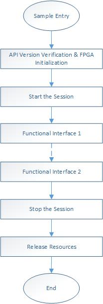

# FPGA Development Samples
[切换到中文版](./README_CN.md)

# Contents

+ [1 About the Development Samples](#sec_1)
+ [2 Preparations](#sec_2)
+ [3 Using the Samples](#sec_3)

# 1 About the Development Samples

The fmtk tool suite is used to manage FPGA devices. You can use the fmtk tool suite to discover devices, view device details, make updated firmware take effect, query device health status, and configure over-power protection. In addition to tools used in the command line interface, the tool suite provides the dynamic library and static library. Users can perform secondary development based on these libraries.

The FPGA development samples are developed based on the APIs provided by the fmtk tool. These samples help users learn the usage of the APIs, accelerating the development speed. The samples include:

+ FPGA information query samples
   + Basic information query samples
   + Detailed information query samples
   + Health status query samples
+ MCU samples
   + MCU firmware upgrade samples
   + MCU log collection samples
   + FPGA reset samples
+ Flash samples
   + Shell firmware upgrade samples
   + Golden firmware upgrade samples
   + Shell erasing samples
   + Firmware validation samples
   + Firmware reloading samples
+ Secure samples
+ EEPROM samples
   + EEPROM data read/write samples
   + MAC address read/write samples

> Log in to the [Huawei enterprise technical support website](https://e.huawei.com/en/) and enter "FX600 interface description" or "FX300 interface description" as the key words in the search box to obtain the fmtk external interface description.

# 2 Preparations

The compilation and running of the samples depend on the dynamic library and static library provided by the fmtk tool. Perform the following operations before using the samples:

## 2.1 Downloading the fmtk Tool

Log in to the [Huawei enterprise technical support website](https://e.huawei.com/en/) and enter "fmtk" as the keyword to obtain the software package.

## 2.2 Installing the fmtk Tool

The .rpm and .deb packages are provided for different OSs. The installation files and installation paths are as follows (using fmtk 2.0.0 as a sample):

### In the CentOS system, run the `rpm -ivh fmtk-2.0.0-1.x86_64.rpm` command.

	rpm -ivh fmtk-2.0.0-1.x86_64.rpm
	Preparing...                          ################################# [100%]
	Updating / installing...
	   1:fmtk-2.0.0-1                     ################################# [100%]

### In the Ubuntu Linux and Debian systems, run the `dpkg -i fmtk-2.0.0-1.x86_64.deb` command.

	dpkg -i fmtk-2.0.0-1.x86_64.deb
	Selecting previously unselected package fmtk.
	(Reading database ... 98589 files and directories currently installed.)
	Preparing to unpack fmtk-2.0.0-1.x86_64.deb ...
	Unpacking fmtk (2.0.0) ...
	Setting up fmtk (2.0.0) ...

> CentOS system: After the tool is installed, the library files are stored in the "/usr/lib64" directory. The "fmtk.json" configuration file is stored in the "/etc/fmtk_config" directory.

> Ubuntu Linux and Debian systems: After the tool is installed, the library files are stored in the "/usr/lib64" directory, and the "fmtk.json" configuration file is stored in the "/etc/fmtk_config" directory.

> For details about how to use the fmtk tool, see [FX300 User Guide](https://support.huawei.com/enterprise/en/doc/EDOC1100053250) or [FX600 User Guide](https://support.huawei.com/enterprise/en/doc/EDOC1100053257).

## 2.3 Modifying the Configuration File

The fmtk.json configuration file provided by the fmtk tool allows users to add logic in a fixed format. For details, see "Software Configuration" in the [FX300 User Guide](https://support.huawei.com/enterprise/en/doc/EDOC1100053250) or [FX600 User Guide](https://support.huawei.com/enterprise/en/doc/EDOC1100053257). After the configuration, users can use the fmtk tool or self-developed tool developed based on the API to perform FPGA management.

## 2.4 Downloading the Samples

+ If you use an HTTPS connection, run the `git clone https://github.com/huawei/fpga-accel.git` command to download the suite.

+ If you use an SSH connection, run the `git clone git@github.com:huawei/fpga-accel.git` to download the suite.

# 3 Using the Samples
The FPGA development samples are stored in the "tools/fmtk" directory. The directory structure is as follows:

	linux-htucef:/home/fpga-accel/tools/fmtk # ll
	total 24
	-rw-r--r--. 1 root root 2217 Jan  9 16:20 build.sh
	drwxr-xr-x. 2 root root 4096 Jan  9 16:26 demo
	-rw-r--r--. 1 root root 3966 Dec 13 10:43 FAQs.md
	drwxr-xr-x. 2 root root  4096 Jan 10 11:50 doc
	drwxr-xr-x. 2 root root 4096 Jan  8 22:27 include
	-rw-r--r--. 1 root root 1582 Jan  9 16:50 LICENSE.txt
	-rw-r--r--. 1 root root 3831 Jan 10 09:42 README.md

[*build.sh*](./build.sh) is the compilation script of the samples.

[*demo*](./demo/) stores the source code and Makefile of the samples.

[*FAQs.md*](./FAQs.md) is a common problem description document.

[*doc*](./doc/) stores tool description documents.

[*include*](./include/) stores "fmtkapi.h".

[*LICENSE.txt*](./LICENSE.txt) is the license file.

[*README.md*](./README.md) is a sample description document.

## 3.1 Development by Using the Samples

The API invoking process of the samples is as follows:

## 3.2 Compiling the Samples

Run the `bash build.sh` command to compile the samples.

	bash build.sh
	
	rm -rf *.o
	rm -f  sample_set_protection_status  sample_upgrade_mcu_firmware  sample_query_protection_status  sample_reload_firmware  sample_activate_shell  sample_upgrade_golden  sample_erase_huawei_shell_firmware  sample_list_devices  sample_upgrade_shell
	rm -f  sample_set_protection_status_dyn  sample_upgrade_mcu_firmware_dyn  sample_query_protection_status_dyn  sample_reload_firmware_dyn  sample_activate_shell_dyn  sample_upgrade_golden_dyn  sample_erase_huawei_shell_firmware_dyn  sample_list_devices_dyn  sample_upgrade_shell_dyn
	rm -rf *.o
	...
	finish linking  sample_set_protection_status_dyn  sample_upgrade_mcu_firmware_dyn  sample_query_protection_status_dyn  sample_reload_firmware_dyn  sample_activate_shell_dyn  sample_upgrade_golden_dyn  sample_erase_huawei_shell_firmware_dyn  sample_list_devices_dyn  sample_upgrade_shell_dyn
	rm -rf *.o
	----------build service succeed----------

## 3.3 Running the Samples

After each sample is compiled, an executable file based on the static library and an executable file based on the dynamic library are generated in the "dist" directory. Files whose names end with "dyn" are compiled based on the dynamic library. Go to the "dist" directory, run the "./sample_xxxx" command, and check the result.

	[root@SIA1000109087 dist]# ll
	total 4092
	-rwxr-xr-x. 1 root root 460080 Jan 10 10:55 sample_activate_shell
	-rwxr-xr-x. 1 root root  13491 Jan 10 10:55 sample_activate_shell_dyn
	-rwxr-xr-x. 1 root root 460134 Jan 10 10:55 sample_erase_huawei_shell_firmware
	-rwxr-xr-x. 1 root root  13598 Jan 10 10:55 sample_erase_huawei_shell_firmware_dyn
	-rwxr-xr-x. 1 root root 268266 Jan 10 10:55 sample_list_devices
	-rwxr-xr-x. 1 root root  13164 Jan 10 10:55 sample_list_devices_dyn
	-rwxr-xr-x. 1 root root 478986 Jan 10 10:55 sample_query_protection_status
	-rwxr-xr-x. 1 root root  13040 Jan 10 10:55 sample_query_protection_status_dyn
	-rwxr-xr-x. 1 root root 460078 Jan 10 10:55 sample_reload_firmware
	-rwxr-xr-x. 1 root root  13488 Jan 10 10:55 sample_reload_firmware_dyn
	-rwxr-xr-x. 1 root root 478982 Jan 10 10:55 sample_set_protection_status
	-rwxr-xr-x. 1 root root  13036 Jan 10 10:55 sample_set_protection_status_dyn
	-rwxr-xr-x. 1 root root 460169 Jan 10 10:55 sample_upgrade_golden
	-rwxr-xr-x. 1 root root  13654 Jan 10 10:55 sample_upgrade_golden_dyn
	-rwxr-xr-x. 1 root root 460166 Jan 10 10:55 sample_upgrade_mcu_firmware
	-rwxr-xr-x. 1 root root  13649 Jan 10 10:55 sample_upgrade_mcu_firmware_dyn
	-rwxr-xr-x. 1 root root 460165 Jan 10 10:55 sample_upgrade_shell
	-rwxr-xr-x. 1 root root  13650 Jan 10 10:55 sample_upgrade_shell_dyn

### 3.3.1 Running the Query Samples
+ The "sample_list_devices" sample discovers devices and queries basic device information such as the logical slots, BDFs, and status of devices.
+ The "sample_query_detail_info" queries the detailed device information of slot 0, such as the optical port information, power information, DIMM information, and electronic label.
+ The health status query function provides the alarm information of the slot 0 (based on the logic provided by Huawei).
> The health status query and detailed information query functions depend on the "mcu_master" component. To use these functions, the component must be integrated in the self-developed logic.

### 3.3.2 Running Flash Samples
+ The "sample_active_shell" sample makes the updated FPGA firmware of slot 0 take effect without restarting the server.
+ The "sample_reload_firmware" sample loads the firmware functions of slot 0 from a specified sector (0 or 1) of the flash.
+ The "sample_erase_shell" sample erases Shell of slot 0.
+ The "sample_upgrade_shell" sample upgrades the firmware for slot 0 (FX300) and queries the upgrade progress. Log in to the Huawei enterprise technical support website](https://e.huawei.com/en/), enter "FX300_ocl_V125_vu5p.zip" as the key word in the search box to obtain the firmware package, copy the firmware package to the "dist" directory, and decompress the package.
+ The "sample_upgrade_golden" sample upgrades the Golden firmware for slot 0 (FX300) and queries the upgrade progress. Log in to the [Huawei enterprise technical support website](https://e.huawei.com/en/), enter "FX300_golden_V009_vu5p.zip" as the key word in the search box to obtain the firmware package, copy the firmware package to the "dist" directory, and decompress the package.
> To use the Shell firmware upgrade sample on the FX600, log in to the [Huawei enterprise technical support website](https://e.huawei.com/en/), enter "FX600_ocl_V162_vu9p.zip" as the key word in the search box to obtain the firmware package, and change the path in the source file based on the actual path of the .bin file in the decompressed package.

> To use the Golden upgrade sample on the FX600, log in to the Huawei enterprise technical support website](https://e.huawei.com/en/), enter "FX600_golden_V102_vu9p.zip" as the key word in the search box to obtain the firmware package, and change the path in the source file based on the actual path of the .bin file in the decompressed package.

### 3.3.3 Running the MCU Samples
+ The "sample_collect_mcu_log" sample collects logs for slot 0 and saves the logs in the "/home" directory.
+ The "sample_upgrade_mcu" sample upgrades the MCU firmware for slot 0 (FX300) and queries the upgrade progress. Log in to the [Huawei enterprise technical support website](https://e.huawei.com/en/), enter "IT21MPFA_MCU_V031.zip" as the key word in the search box to obtain the firmware package, copy the firmware package to the "dist" directory, and decompress the package.
+ The "sample_reset_fpga" sample resets slot 0.
+ The "sample_query_protection_status" sample queries the over-power protection status of slot 0.
+ The "sample_set_protection_status" sample enables over-power protection for slot 0.
> The MCU samples depend on the "mcu_master" component. To use these functions, the component must be integrated in the self-developed logic.

> To use the MCU firmware upgrade sample on the FX600, log in to the [Huawei enterprise technical support website](https://e.huawei.com/en/), enter "IT21PCCB_MCU_V031.zip" as the key word in the search box to obtain the firmware package, and change the path in the source file based on the actual path of the .bin file in the decompressed package.

### 3.3.4 Running the Secure Sample

 The "sample_secure" sample provides functions of the security chip in slot 0, such as security chip resetting, echo, and life cycle check, and reading the certificate of sector 0.
> The security chip supports only the Golden logic.

### 3.3.5 Running the EEPROM samples
+ The "sample_read_mac" sample reads the MAC address of sector 0 slot 0.
+ The "sample sample_write_mac" sample writes the MAC address of sector 0 slot 0.
+ The "sample sample_write_ascii" sample writes the "hello, world!" string into slot 0.
+ The "sample_read_ascii" reads the ASCII value stored in the EEPROM of slot 0.

\----End