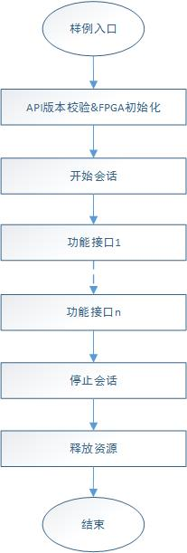

# FPGA开发样例
[Switch to the English version](./README.md)

# 目录

+ [1 关于开发样例](#sec_1)
+ [2 使用前准备](#sec_2)
+ [3 使用样例](#sec_3)

# 1 关于开发样例

fmtk是一款针对FPGA设备的管理工具套件，具备设备发现、详细信息查询、固件升级生效、健康状态查询、过功率保护设置等功能。工具套件除了提供命令行工具外，还提供了动态库和静态库，用户可以基于这些库文件进行二次开发。

FPGA开发样例是基于fmtk工具提供API接口进行开发，用户可参考样例编写思路了解API使用方法，加快开发速度。样例集包含：

+ FPGA信息查询样例
   + 基本信息查询样例
   + 详细信息查询样例
   + 健康状态查询样例
+ mcu相关样例
   + mcu固件升级样例
   + mcu日志收集样例
   + fpga复位样例
+ flash相关样例
   + shell固件升级样例
   + golden固件升级样例
   + shell擦除样例
   + 固件生效样例
   + 固件重加载样例
+ secure样例
+ eeprom相关样例
   + eeprom数据读写样例
   + MAC地址读写样例

> 登录[华为企业业务技术支持网站](http://support.huawei.com/enterprise/zh/index.html)，在搜索框中输入关键字“FX600 接口说明书”或者“FX300 接口说明书”获取fmtk对外接口说明书。

# 2 使用前准备

样例的编译和运行依赖fmtk工具提供动态库和静态库，在使用样例前需要完成以下操作。

## 2.1 下载fmtk工具

登录[华为企业业务技术支持网站](http://support.huawei.com/enterprise/zh/index.html)，在搜索框中输入关键字“fmtk”获取软件包。

## 2.2 安装fmtk工具

针对不同的操作系统提供了rpm包和deb包，具体安装文件和安装路径如下所示（本文档以2.0.0版本为例进行说明）。

### CentOS系统执行`rpm -ivh fmtk-2.0.0-1.x86_64.rpm`.

	rpm -ivh fmtk-2.0.0-1.x86_64.rpm
	Preparing...                          ################################# [100%]
	Updating / installing...
	   1:fmtk-2.0.0-1                     ################################# [100%]

### Ubuntu Linux和Debian系统执行`dpkg -i fmtk-2.0.0-1.x86_64.deb`.

	dpkg -i fmtk-2.0.0-1.x86_64.deb
	Selecting previously unselected package fmtk.
	(Reading database ... 98589 files and directories currently installed.)
	Preparing to unpack fmtk-2.0.0-1.x86_64.deb ...
	Unpacking fmtk (2.0.0) ...
	Setting up fmtk (2.0.0) ...

> CentOS系统:工具安装后相关库文件会存在“/usr/lib64”目录下，配置文件fmtk.json存放在“/etc/fmtk_config”路径下。

> Ubuntu Linux和Debian系统:工具安装后相关库文件会存在在“/usr/lib64”目录下，配置文件fmtk.json存放在“/etc/fmtk_config”路径下。

> fmtk详细使用方法请参考[《FX300用户指南》](https://support.huawei.com/enterprise/zh/doc/EDOC1100053253)或[《FX600用户指南》](https://support.huawei.com/enterprise/zh/doc/EDOC1100053260)。

## 2.3 修改配置文件

fmtk工具提供的配置文件fmtk.json允许用户按照固定格式添加自有逻辑，配置方法请参考[《FX300用户指南》](https://support.huawei.com/enterprise/zh/doc/EDOC1100053253)或[《FX600用户指南》](https://support.huawei.com/enterprise/zh/doc/EDOC1100053260)中的“软件配置”章节。配置后无论用户是使用的fmtk工具或者基于API开发的自研工具都可以方便的进行FPGA管理。

## 2.4 下载样例

+ 对于https连接执行`git clone https://github.com/huawei/fpga-accel.git`命令将开发套件下载到您的本地服务器。

+ 对于ssh连接执行`git clone git@github.com:huawei/fpga-accel.git`命令将开发套件下载到您的本地服务器。

# 3 使用样例
FPGA开发样例存放在“tools/fmtk”路径下，样例目录结构如下。

	linux-htucef:/home/fpga-accel/tools/fmtk # ll
	total 24
	-rw-r--r--. 1 root root 2217 Jan  9 16:20 build.sh
	drwxr-xr-x. 2 root root 4096 Jan  9 16:26 demo
	-rw-r--r--. 1 root root 3966 Dec 13 10:43 FAQs.md
	drwxr-xr-x. 2 root root  4096 Jan 10 11:50 doc
	drwxr-xr-x. 2 root root 4096 Jan  8 22:27 include
	-rw-r--r--. 1 root root 1582 Jan  9 16:50 LICENSE.txt
	-rw-r--r--. 1 root root 3831 Jan 10 09:42 README.md

[*build.sh*](./build.sh) 是样例编译脚本

[*文件夹demo*](./demo/) 用于存放样例源码以及Makefile

[*FAQs.md*](./FAQs.md) 为常见问题说明文档

[*文件夹doc*](./doc/) 用于存放工具相关的说明文档

[*文件夹include*](./include/) 用于存放fmtkapi.h

[*LICENSE.txt*](./LICENSE.txt) 为许可文件

[*README.md*](./README.md) 是样例说明文档

## 3.1 用例开发流程

用例的API调用流程如下：

## 3.2 编译用例

执行`bash build.sh`命令，完成样例的编译。

	bash build.sh
	
	rm -rf *.o
	rm -f  sample_set_protection_status  sample_upgrade_mcu_firmware  sample_query_protection_status  sample_reload_firmware  sample_activate_shell  sample_upgrade_golden  sample_erase_huawei_shell_firmware  sample_list_devices  sample_upgrade_shell
	rm -f  sample_set_protection_status_dyn  sample_upgrade_mcu_firmware_dyn  sample_query_protection_status_dyn  sample_reload_firmware_dyn  sample_activate_shell_dyn  sample_upgrade_golden_dyn  sample_erase_huawei_shell_firmware_dyn  sample_list_devices_dyn  sample_upgrade_shell_dyn
	rm -rf *.o
	...
	finish linking  sample_set_protection_status_dyn  sample_upgrade_mcu_firmware_dyn  sample_query_protection_status_dyn  sample_reload_firmware_dyn  sample_activate_shell_dyn  sample_upgrade_golden_dyn  sample_erase_huawei_shell_firmware_dyn  sample_list_devices_dyn  sample_upgrade_shell_dyn
	rm -rf *.o
	----------build service succeed----------

## 3.3 运行用例

样例编译完成后，会分别生成基于静态库和动态库的可执行文件（文件名称带dyn的为基于动态库编译的可执行文件），文件存放在dist目录下。用户进入dist目录后，执行./sample_xxxx命令，查看运行结果。

	[root@SIA1000109087 dist]# ll
	total 4092
	-rwxr-xr-x. 1 root root 460080 Jan 10 10:55 sample_activate_shell
	-rwxr-xr-x. 1 root root  13491 Jan 10 10:55 sample_activate_shell_dyn
	-rwxr-xr-x. 1 root root 460134 Jan 10 10:55 sample_erase_huawei_shell_firmware
	-rwxr-xr-x. 1 root root  13598 Jan 10 10:55 sample_erase_huawei_shell_firmware_dyn
	-rwxr-xr-x. 1 root root 268266 Jan 10 10:55 sample_list_devices
	-rwxr-xr-x. 1 root root  13164 Jan 10 10:55 sample_list_devices_dyn
	-rwxr-xr-x. 1 root root 478986 Jan 10 10:55 sample_query_protection_status
	-rwxr-xr-x. 1 root root  13040 Jan 10 10:55 sample_query_protection_status_dyn
	-rwxr-xr-x. 1 root root 460078 Jan 10 10:55 sample_reload_firmware
	-rwxr-xr-x. 1 root root  13488 Jan 10 10:55 sample_reload_firmware_dyn
	-rwxr-xr-x. 1 root root 478982 Jan 10 10:55 sample_set_protection_status
	-rwxr-xr-x. 1 root root  13036 Jan 10 10:55 sample_set_protection_status_dyn
	-rwxr-xr-x. 1 root root 460169 Jan 10 10:55 sample_upgrade_golden
	-rwxr-xr-x. 1 root root  13654 Jan 10 10:55 sample_upgrade_golden_dyn
	-rwxr-xr-x. 1 root root 460166 Jan 10 10:55 sample_upgrade_mcu_firmware
	-rwxr-xr-x. 1 root root  13649 Jan 10 10:55 sample_upgrade_mcu_firmware_dyn
	-rwxr-xr-x. 1 root root 460165 Jan 10 10:55 sample_upgrade_shell
	-rwxr-xr-x. 1 root root  13650 Jan 10 10:55 sample_upgrade_shell_dyn

### 3.3.1 运行查询用例
+ 基本信息查询用例sample_list_devices提供设备发现功能，实现设备逻辑槽位、BDF、设备状态等基本信息查询。
+ 详细信息查询用例sample_query_detail_info提供槽位0的光口信息、功率信息、DIMM信息以及电子标签等信息的查询。
+ 健康状态查询实现槽位0（基于华为逻辑）的告警信息查询。
> 健康状态查询和详细信息查询依赖mcu_master组件，如果客户需要使用此部分功能，需要在自有逻辑中集成此组件。

### 3.3.2 运行Flash用例
+ 固件生效样例sample_active_shell提供槽位0的FPGA固件升级后生效功能，在不重启服务器情况下使新烧入的固件生效。
+ 固件重加载样例sample_reload_firmware实现槽位0从Flash指定扇区（0或者1）加载固件功能。
+ shell擦除样例sample_erase_shell实现槽位0的shell擦除。
+ shell固件升级样例sample_upgrade_shell实现槽位0（FX300）的固件升级和升级进度查询。用户需要登录[华为企业业务技术支持网站](http://support.huawei.com/enterprise/zh/index.html)，在搜索框中输入关键字“FX300_ocl_V125_vu5p.zip”获取固件包，并将固件包拷贝至dist目录下进行解压。
+ golden升级样例sample_upgrade_golden实现槽位0（FX300）的golden升级和进度查询功能。用户需要登录[华为企业业务技术支持网站](http://support.huawei.com/enterprise/zh/index.html)，在搜索框中输入关键字“FX300_golden_V009_vu5p.zip”获取固件包，并将固件包拷贝至dist目录下进行解压。
> 用户如果要在FX600环境使用shell固件升级样例，用户需要登录[华为企业业务技术支持网站](http://support.huawei.com/enterprise/zh/index.html)，在搜索框中输入关键字“FX600_ocl_V162_vu9p.zip”获取固件包，并按照解压后的实际bin文件名修改源文件中的路径名。

> 用户如果要在FX600环境使用golden升级样例，用户需要登录[华为企业业务技术支持网站](http://support.huawei.com/enterprise/zh/index.html)，在搜索框中输入关键字“	FX600_golden_V102_vu9p.zip”获取固件包，并按照解压后的实际bin文件名修改源文件中的路径名。

### 3.3.3 运行mcu用例
+ mcu日志收集样例sample_collect_mcu_log提供槽位0的日志收集功能，日记收集完毕后存储在“/home”路径下。
+ mcu固件升级样例sample_upgrade_mcu实现槽位0（FX300）的mcu固件升级以及升级进度查询功能。用户需要登录[华为企业业务技术支持网站](http://support.huawei.com/enterprise/zh/index.html)在搜索框中输入关键字“IT21MPFA_MCU_V031.zip”获取固件包，并将固件包拷贝至dist目录下进行解压。
+ mcu复位样例sample_reset_fpga实现槽位0的复位功能。
+ 过功率保护开关查询样例sample_query_protection_status实现槽位0的保护开关状态查询。
+ 过功率保护开关设置样例sample_set_protection_status实现槽位0的开关状态开启功能。
> mcu相关样例依赖mcu_master组件，如果客户需要使用此功能，需要在自有逻辑中集成此组件。

> 用户如果要在FX600环境使用mcu固件升级样例，用户需要登录[华为企业业务技术支持网站](http://support.huawei.com/enterprise/zh/index.html)，在搜索框中输入关键字“IT21PCCB_MCU_V031.zip”获取固件包，并按照解压后的实际bin文件名修改源文件中的路径名。

### 3.3.4 运行secure样例

 secure使用样例sample_secure实现了槽位0的安全芯片的操作全流程，实现安全芯片复位功能、echo功能、生命周期检查、读0区证书等功能。
> 安全芯片目前仅支持golden逻辑。

### 3.3.5 运行eeprom样例
+ MAC地址查询样例sample_read_mac实现了槽位0区域0的MAC地址读取。
+ MAC地址写入样例sample_write_mac实现槽位0区域0固定MAC地址的写入。
+ eeprom数据写入样例sample_write_ascii实现了槽位0 “hello,world!”字符串写入。
+ eeprom数据查询样例sample_read_ascii实现了槽位0 eeprom存储的ascii值读取。

\----End